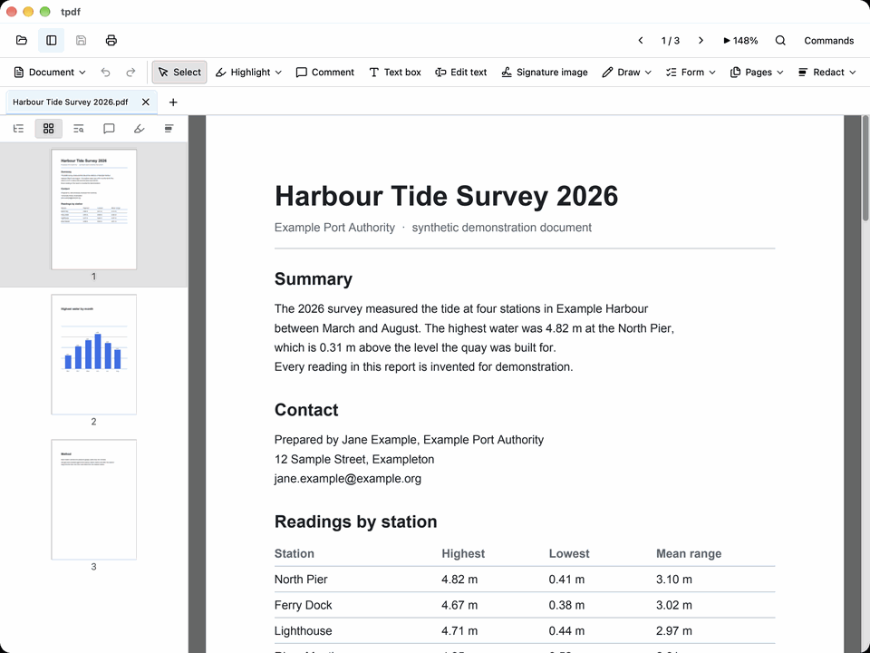
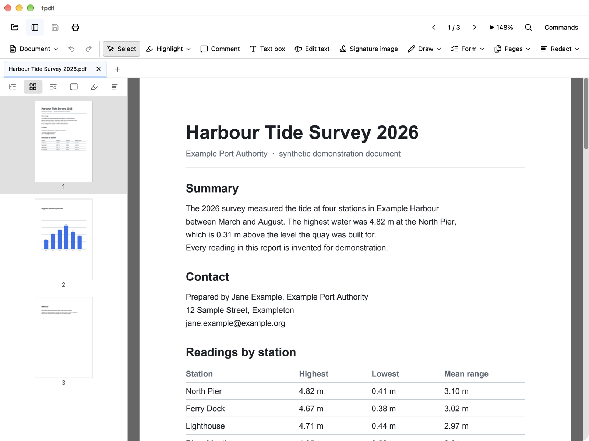
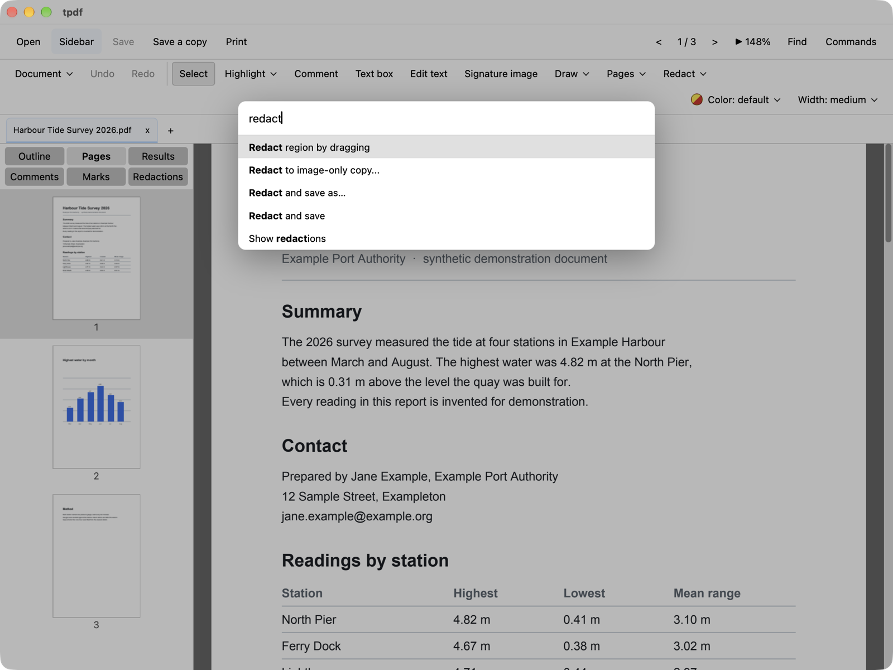
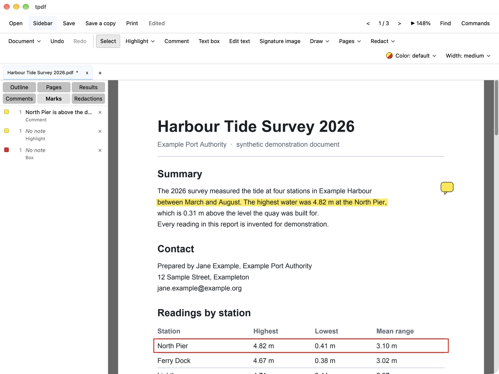
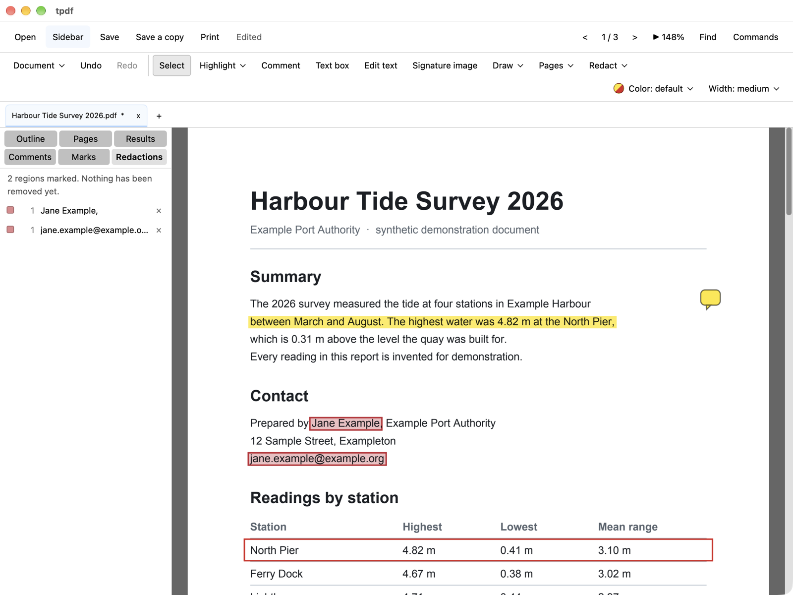
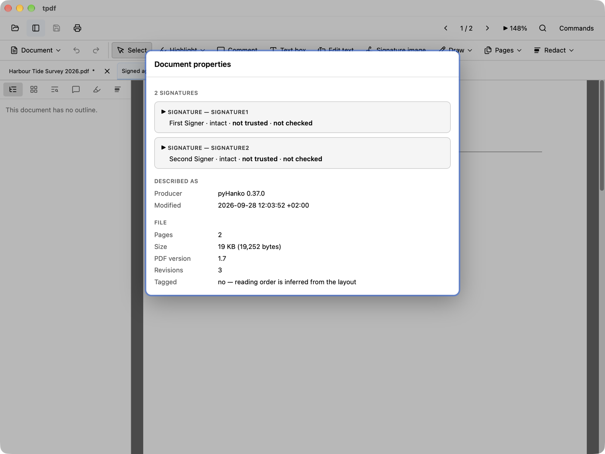

# tpdf

A fast, lightweight PDF viewer and editor for macOS and Windows.

SumatraPDF's speed with Acrobat's capability, and a UI where you never hunt for a tool.



**Download:** installers for macOS (Apple silicon) and Windows are on the
[Releases](https://github.com/tstone-1/tpdf/releases) page. Free, MIT-licensed, no account,
no telemetry; your documents are not uploaded anywhere.

With Homebrew on a Mac:

```
brew install --cask tstone-1/tpdf/tpdf
```

## What it does

**Fast to open, with the pages beside the text.** From launch to the first page painted
is 276 ms, measured warm on an Apple silicon Mac.



**Every tool is in the command palette.** Type part of its name and press Enter; nothing
is buried in a menu.



**Annotate and edit.** Highlight, underline, draw, add boxes, text boxes, stamps and
comments; turn, move, delete, crop, extract and insert pages; fill forms; change existing
text within the limits listed further down.



**Redact for real.** A redaction removes the words from the file; it does not draw a black
box over them. You mark regions, review them in a list, and tpdf reads the result back and
tells you whether the removal is verified.



**Sign and check signatures.** Sign with a certificate from the macOS keychain or the
Windows certificate store, with a timestamp and long-term validation data if you want
them. For a signed document, tpdf says whether each signature is intact, whether your
computer trusts the signer, and what was added after signing.



## Script it

Everything above is also a command-line tool with JSON output, and a Python client on top
of it. The tool runs the same code as the window, in the same sandboxed worker processes.

```
tpdf info report.pdf
tpdf text report.pdf --pages 1-3,7 -o report.txt
tpdf search *.pdf --text "North Pier"
tpdf merge cover.pdf report.pdf appendix.pdf -o combined.pdf --json
tpdf fill application.pdf -o filled.pdf --values answers.json
tpdf sign contract.pdf -o contract-signed.pdf --identity "Jane Doe" --timestamp digicert
tpdf verify --strict --json *.pdf
```

```python
from tpdf import Tpdf

pdf = Tpdf()
report = pdf.redact("letter.pdf", "letter-redacted.pdf", texts=["Jane Doe"])
assert report["written"] and report["verified"]
assert pdf.verify("contract-signed.pdf")["files"][0]["signatures"][0]["integrity"]["verdict"] == "intact"
```

Twenty commands in all: [Command-line tool](#command-line-tool) has each of them, how to
install the tool, and the Python client.

## Status

**Status: released for macOS and Windows, with annotations, page editing, redaction, form filling, visual and certificate signatures, bounded text editing and a command-line tool.**
The feasibility spikes are done and every load-bearing assumption has a measured verdict;
on top of that evidence there is a viewer you can read a PDF in, on macOS arm64 and on
Windows, including documents behind a password. **It edits**: pages can be turned, moved,
deleted, cropped and extracted, a blank one inserted at the size you name, and the pages of another file inserted; text can be highlighted, underlined, struck out or
squiggled; and you can draw on a page, put a box, an ellipse, a text box, a stamp or a
comment on it, move what you put there, erase any of it, rewrite, answer or delete a comment
somebody else left, and save — over the open file or to a copy. **It redacts**: mark regions, review them in a list, and remove the words from
the page's own instructions — over the open file or to a copy — with the result read
back and reported either way. What is *not* built is the list further down, and
general text editing is the one that matters. The editor supports a bounded set of
text layouts and fonts, with adjustable text boxes, wrapping, and new characters set in an
installed copy of the document's font or in bundled Noto.
Fill text fields, checkboxes, radio groups,
dropdowns and lists, or draw and import a visual signature to place on a page. Sign a
document with a certificate from your macOS keychain or Windows certificate store, see
whether each signature in a document is intact and whether your computer trusts its signer,
and sign, verify, extract, fill and redact from scripts with the `tpdf` command-line tool.
Installers are on the [Releases](https://github.com/tstone-1/tpdf/releases) page:
macOS is signed with a Developer ID identity and notarized, Windows is unsigned and
SmartScreen will warn on first launch. See [`docs/PLAN.md`](docs/PLAN.md) for the
architecture and roadmap, [`docs/THREAT-MODEL.md`](docs/THREAT-MODEL.md) for the security
position, [`BUILD.md`](BUILD.md) to build it yourself, and [`AGENTS.md`](AGENTS.md) for
project conventions.

## What the viewer does today

- Every document is parsed and rendered in **sandboxed worker processes** with no
  filesystem or network authority on macOS, and none to *write* on Windows, where the
  boundary stops neither reading what the user can read nor opening a socket — a pool per
  document, and a worker that dies is replaced and its request retried. Saving over a document is prepared and written
  there too, and so is a redaction applied to it — and since 2026-09-01 so are Save a copy,
  Redact to a copy, Extract, Split, Merge, and printing — whether you print the document you
  are looking at or a page range you type. **No `lopdf` parse of a document happens in the app
  process at all on either shipped platform** — the redaction verification was the last one
  and moved into a worker on 2026-09-01; [`docs/THREAT-MODEL.md`](docs/THREAT-MODEL.md) has
  the account, including why a path that only *reads* was missed by a section, a risk and a
  gate that are all keyed on writing.
- Tiled rendering behind a virtual scroller; zoom — in, out, actual size, fit-width,
  fit-page, or a figure you type; view rotation; and page inversion for reading on a dark
  screen. **Hold the middle mouse button and the pages follow the pointer**, sideways as
  well as down — which past fit-width is the only way to reach the right-hand side of a
  page.
  <!-- built: view.zoomIn view.zoomOut view.zoomTo view.actualSize view.fitWidth view.fitPage view.rotateClockwise view.rotateCounterClockwise view.invertPages -->
- Text selection and copy; find-in-document, with case, whole-word, regular-expression and
  within-the-selection options; a sidebar carrying the outline, a page-thumbnail strip and
  your own marks; and a text layer for screen readers.
  <!-- built: edit.selectAll edit.copy find.open find.next find.previous find.matchCase find.wholeWord find.regex find.inSelection view.toggleSidebar view.showOutline view.showThumbnails view.showMarks -->
- **Links are followable**, and so is the way back: Back and Forward walk the jumps you have
  made, and Next link / Previous link reach one without the pointer. Back and Forward grey out
  when there is nowhere to go.
  <!-- built: nav.back nav.forward nav.nextLink nav.previousLink -->
- **Web links open in your browser, after you confirm the site.** `http` and `https` only —
  everything else a `/URI` can name is still declined — and the confirmation shows the host
  in the form that cannot lie: an internationalised name is shown as its punycode, never as
  the lookalike it renders to. Every link is asked about every time; there is no "always allow
  this site", because a permission granted from a document a stranger sent is one you would
  never be asked about again.
- **Document tabs** keep several PDFs open with separate edits, reading positions,
  searches and sidebar choices. Ctrl+Tab / Ctrl+Shift+Tab switch tabs; Ctrl+W
  (Cmd+W on macOS) closes one, checking for unsaved changes, and so does a middle-click
  on the tab. Right-click a tab to show its file in Explorer or Finder, copy its path,
  close it, or close all tabs, which asks once if any of them has unsaved changes.
  The tab labels' size is adjustable: Larger, Smaller and Default tab labels, in the
  View menu and the command palette; the choice is remembered.
  <!-- built: file.close file.closeAll view.nextTab view.previousTab view.tabLabelsLarger view.tabLabelsSmaller view.tabLabelsDefault -->
- Notices when another program rewrites the open file. By default it says so and offers
  a reload; *When the file changes on disk: reload automatically* reloads at once, keeping
  your page and zoom, which suits a document a build regenerates. *…: do nothing* turns the
  check off. Unsaved edits are never discarded without asking. The choice is remembered.
  <!-- built: file.onDiskChange.ask file.onDiskChange.reload file.onDiskChange.ignore -->
- Session restore: the most recent document, page, zoom and rotation you left on.
  The full tab list is not restored after restarting.
- **A document behind a password opens**: tpdf asks for one and retries, and holds it for
  as long as the document is open, because every worker that renders it meets the same
  encryption.
- **What a document says about itself**: its title and producer, whether it is encrypted
  and what that permits, what conformance it claims, and who signed it — the signer's
  certificate, its issuer and its validity, read out of the signature itself. Two things
  are checked rather than read: whether each signature still covers the bytes it was made
  over, and whether your computer's own trust store vouches for the signer's certificate
  (without going online). Revocation is judged only from the data the document itself
  carries, for the signer's certificate and every one above it; a document carrying none
  says it was not checked.
  <!-- built: file.properties -->
- **Make tpdf the default PDF app** when you want it, from the command palette or the
  application menu. tpdf never asks: nothing checks at start whether it is the default. On
  macOS the command sets it and says so; Windows lets only you choose, so there it opens
  Settings at Default apps.
  <!-- built: app.makeDefaultPdfApp -->
- Printing through the system print panel, on both platforms — and every print job is read
  back through the operating system's own PDF parser before the panel opens, which is a
  parser independent of the one that wrote the job and the one that drew what you saw.
  macOS prints vectors; Windows has no in-box "print this PDF" API at any layer, so it
  rasterises at 300 dpi like every other Windows PDF viewer does.
  <!-- built: file.print -->
- A compact toolbar exposes the editing tools, with grouped menus and contextual
  colour and width controls. Every command is also reachable from the command palette,
  which renders each shortcut from the
  same table the key handler matches against, so a label cannot advertise a chord that
  does nothing.

All of that has run on macOS arm64 and on Windows. Every *measurement* quoted in this
repository is macOS arm64 unless it says otherwise: the two platforms differ enough that
carrying a number across is a guess rather than an estimate, and where both have been
measured the Windows render constants come out 1.5–1.8x worse.

## What it edits today

- **Fill PDF forms** with text, checkboxes, radio buttons, dropdowns and selection lists. Tab moves between fields;
  **Fill form** in the command palette focuses the first field. Answers support undo
  and save with explicit appearances, including shared fields. Text entry
  supports plain text with Western European characters; unsupported controls and
  read-only fields remain unchanged. JavaScript and XFA are not supported.
  <!-- built: edit.fillForm -->

- **Add a visual signature** with **Signature image** in the toolbar or
  **Place signature image** in the command palette. Draw it or import a PNG/JPEG,
  then drag to place it on the page.
  Move it, resize it with Smaller/Larger, or remove it; every edit supports undo.
  Saving embeds its appearance as a PDF stamp, without identity or certificate verification.
  Remembering it is optional and uses macOS Keychain or Windows user-scoped DPAPI.
  Imported PNG/JPEG dimensions are bounded before image decoding.
  <!-- built: edit.addSignature -->

- **Sign a document with a certificate you already have** — **Sign document…** in the
  File menu or the command palette. tpdf lists the certificates in your macOS keychain or
  Windows certificate store that can sign, you pick one and name a new file, and the
  signed copy is written beside the original, which is not changed. The private key never
  leaves the operating system: macOS or Windows makes the signature, and any PIN or access
  prompt you see is theirs. The signature is PAdES baseline B-B (a CAdES detached
  signature over SHA-256, RSA or ECDSA P-256/P-384), added as an incremental revision so
  signatures already in the document stay intact, and the written file is read back and
  its signatures checked before you are told it worked. It can be invisible, or drawn on
  the page where you place it — your saved signature image, the signer's name, the date,
  and a reason and location if you give them. Without a timestamp its time is the one your
  computer's clock said; **with one**, a timestamp authority you choose — DigiCert, Sectigo,
  GlobalSign or another address — confirms when it existed (PAdES B-T). None is chosen until
  you choose one, and tpdf then remembers it. It sends the authority a hash of the new
  signature and nothing of the document, checks the answer before anything is written, and
  writes nothing if no timestamp that checks out comes back: you can try again or sign
  without one, and neither asks for your key again. With a timestamp you can also tick
  **Keep it verifiable after the certificates expire** (PAdES B-LT): tpdf then asks the
  certificate authorities whether your certificate, the timestamp authority's and the ones
  above them are revoked — OCSP first, the revocation list if there is no answer — checks each
  answer, and adds the answers and the certificates to the document, then asks the same
  timestamp authority for an archive timestamp over the whole (PAdES B-LTA) — so the signature
  can be checked after the certificates expire and the authorities stop answering, including the
  timestamp authority's own. It is unticked
  until you tick it, and remembered. A certificate from a certificate authority that publishes
  no revocation data — a self-made one, say — cannot have it, and the message says so; the
  timestamp alone still works. If the data cannot be had or does not check out, nothing is
  written, and you can try again or sign without it, which keeps the timestamp; a certificate
  its authority says is revoked is refused outright. A timestamp already on a signature you
  open is checked, in the document's properties. Documents with unsaved edits, encrypted documents and
  documents certified against any change are refused. The same signing and checking is
  available from a terminal: see [Command-line tool](#command-line-tool).
  <!-- built: file.signDocument -->

- **Saving signed or certified documents requires confirmation.** The current writer
  may invalidate their cryptographic signatures, including when filling permitted
  form fields. This warning does not verify the signatures.


- **Turn a page in the document**, not only in the view — with undo and redo, and a
  history that survives any number of turns because it is replayed rather than reversed.
  <!-- built: edit.rotatePageClockwise edit.rotatePageCounterClockwise edit.undo edit.redo -->
- **Delete a page**, from the command palette. Undo puts it back where it was, with its own
  rotation. It has no keyboard shortcut on purpose: it is the one command that removes
  something you can see.
  <!-- built: edit.deletePage -->
- **Move a page** by dragging its thumbnail in the page strip, or one slot at a time from
  the palette. A moved page takes its size, its crop and its rotation with it even where the
  file states none of them on the page itself — a PDF lets a page inherit those from the
  group it sits in, and that is where moving one silently changes it.
  <!-- built: edit.movePageUp edit.movePageDown -->
- **Insert a blank page** after the one you are reading — the size of the page you are
  looking at, or A3, A4, A5, US Letter or US Legal by name. It turns, moves, deletes and
  takes marks like any other page. You cannot crop one or redact it: a crop box is
  measured against a page of the file and a redaction removes content, and a page tpdf
  made has neither — so both are refused when you try rather than lost when you save.
  <!-- built: edit.insertBlankPage edit.insertPage.a4 edit.insertPage.a3 edit.insertPage.a5 edit.insertPage.letter edit.insertPage.legal -->
- **Insert the pages of another file** after the one you are reading — every page of it, or
  a range you type such as `2-5,9`, in its own order, as one step that one undo takes back
  out. The other file is opened the way a document is, in a sandboxed process of its own,
  so its pages are drawn, searched, selected, marked, turned and cropped like the
  document's own, and saving writes them into the file. Their text edits like the document's
  own text, with the same discovery, the same box and the same refusals. A web link on one
  opens in your browser after the same confirmation as a link on the document's own page.
  You can mark regions for removal on the document's own pages while they are there; what
  waits for the save is redacting one of the inserted pages, and making an image-only copy,
  both of which are refused where you ask for them and say which page they mean. An
  encrypted file is refused. Inserting the same page of the same file twice is
  allowed, and editing the text of a page that is in the document twice is not — an edit
  reaches the file it came from, so it would appear in both.
  <!-- built: edit.insertPages edit.insertPages.range -->
- **Print what you edited.** A print job carries the pages that are left, the order they
  are in and the way each one is turned, read from the document model rather than from the
  file on disk.
- **Mark a selection** — highlight, underline, strike out or squiggle — as a real PDF
  annotation, not a rectangle drawn over the page, so Acrobat and Preview show it as what
  it is. Each mark takes a note, and **Next mark** / **Previous mark** walk them from the
  keyboard: the pointer is not the only way to reach one.
  <!-- built: edit.highlightSelection edit.underlineSelection edit.strikeoutSelection edit.squigglySelection nav.nextMark nav.previousMark -->
- **Draw on a page** — freehand ink, a box, an ellipse, a text box, or a comment placed
  where you press. Each is a real annotation of its own kind rather than ink pretending to
  be one, so another reader gets a comment they can open and a shape they can select. What
  you have drawn can be dragged to somewhere else on its page afterwards.
  <!-- built: edit.draw edit.drawBox edit.drawEllipse edit.addTextBox edit.addComment -->
- **Choose a colour** for a mark — seven of them, the default among them. Chosen with a
  note open it recolours that mark; chosen with none open it sets what the next one will
  be, which is the commoner of the two and is why it is offered either way.
  <!-- built: edit.color.default edit.color.yellow edit.color.green edit.color.blue edit.color.pink edit.color.orange edit.color.red -->
- **Choose a nib** — fine, medium, broad or marker — and every drawing after it is that
  thick, in the file as well as on screen. The preview under your hand is drawn at the
  weight you picked, so what you watch is what you get. Unlike a colour it applies to the
  next drawing rather than to one already made.
  <!-- built: edit.nib.fine edit.nib.medium edit.nib.broad edit.nib.marker -->
- **Stamp a document** APPROVED, CONFIDENTIAL, DRAFT or FINAL, dragged out like a box. The
  word is set to fill the rectangle you dragged, and it is written as a real `/Stamp`
  annotation carrying the standard name as well as the picture — so another reader gets a
  stamp rather than a drawing that looks like one.
  <!-- built: edit.stamp.approved edit.stamp.confidential edit.stamp.draft edit.stamp.final -->
- **Erase what you marked** by dragging across it. The nib takes strokes out of a drawing
  and leaves the rest of it; every other kind has no parts to lose, so it goes whole —
  which is the only way to take a highlight off without opening its note first. It reaches
  your own marks and nothing else: a comment the file arrived with is never touched. A
  mark whose note you have opened can be removed from the note box instead, which is how
  you take off the one you have named rather than the ones you cross.
  <!-- built: edit.erase edit.removeMark -->
- **Edit a comment somebody else wrote.** Open it and press Edit — or ask for it by name
  from the palette — and the note becomes a box you can type in. What you write replaces
  the comment's text and its date, so the next reader is not shown your words over
  somebody else's timestamp. It is journalled like every other edit, so undo takes it back,
  and it is written by adding to the file rather than rewriting it: the revision the
  comment came in is still there, byte for byte. A comment the file wrote directly into a
  page rather than as an object of its own cannot be edited — there is nothing to
  override — and those offer no Edit button rather than one that fails.
  <!-- built: edit.editForeignMark -->
- **Reply to a comment somebody else left.** The answer is a comment of your own, written
  into the file's own thread rather than beside it: it carries `/IRT`, which is the key
  every PDF reader uses to nest a reply under the note it answers, so Acrobat and Preview
  show it in the thread and not as a stray second note. It goes on the parent's own
  rectangle, so the two halves of a thread sit together on the page. Like an edit, it is
  journalled and undoable, and it is written by adding to the file rather than rewriting
  it. A blank reply is not sent — opening the box and changing your mind adds nothing.
  <!-- built: edit.replyToComment -->
- **Delete a comment somebody else left.** The comment goes off the page and its bytes go
  out of the file — the words are not left behind unreachable, which is what removing a
  reference alone would do. It is journalled and undoable like every other edit. Two things
  follow from what a deletion is: unlike an edit or a reply it cannot be written by adding
  to the file, so saving after one rewrites the document rather than appending to it; and a
  comment one of your own replies answers is refused until you delete the reply, because a
  reply points at its parent by object number and a thread with no parent is a file no
  reader can show correctly.
  <!-- built: edit.deleteComment -->
- **Crop a page**, either to what is on it or to a rectangle you drag out. Cropping to
  content measures where the ink actually is rather than reading the page's objects, so it
  works on a scan — where every object union is the whole sheet — as well as on a page of
  type. Dragging is for the cases a measurement cannot answer: a figure out of a plate, one
  column of two, a scan with a hand in the corner. While you drag, what falls outside the
  rectangle is darkened, so what stays bright is what the page becomes. The crop is part of the document: undoable, carried when the page moves,
  and written into a saved copy as a real `/CropBox`, so another reader opens the file
  cropped the way you left it.
  <!-- built: edit.cropToDrag edit.cropToContent edit.resetCrop -->
- **Mark a region for redaction** — and nothing more than mark it. Drag out a region and
  it joins a list, drawn in red over the page with the words still readable underneath,
  because a region you cannot see through is one you cannot check. Undo takes it back off.
  **Marking removes nothing and writes no file.** Removal is a separate command, three
  bullets down, and keeping the two apart is the point: what you mark is what you get to
  look at before anything happens to it. A region that has only been marked must not look
  like one that has been removed, so a pending region is never black, never saved, and never
  written into a copy — see the two entries under *What Phase 0 established* for why this
  is the hardest thing here to get right. A page inserted from another file cannot be
  marked, and says so when you try: tpdf can only remove content from the pages of the file
  you opened — both working out what to take and taking it are addressed to that document —
  and a removal reaches the file the page came from, so it would strike every place that
  page appears.
  <!-- built: edit.redactRegion -->
- **Review what you marked**, in a sidebar tab that lists every pending region down the
  document with the words under it, so you can check six regions across forty pages
  without scrolling to each one. A region covering no text says so, which is worth
  knowing: it means a removal would take nothing out of that rectangle. The panel is
  where a region comes off again — undo is chronological, and the second of six you
  drew is not reachable that way. It says what every row here has in common: nothing has
  been removed yet.
  <!-- built: view.showRedactions -->
- **Redact and save as** writes a new file with the marked regions' text removed from the
  page's instructions and then reads that file back and
  tells you what it found. It says *verified*, or it says it could not prove the file is
  clean and why. It never says nothing. **When a word you removed is still somewhere in the
  file it says which page**, and whether that page is one you marked: a word left on a page
  you marked is a removal that did not take, and the same word on a page nobody marked is
  another copy the removal was never asked about. Where it cannot place one — a block more
  than one page draws, or bytes no page reaches — it says it could not, rather than naming a
  page it cannot stand behind. Either way the file is still not called clean while a word you
  removed is anywhere in it. **That reading is visual as well as textual**: the
  area you removed is rendered and put through the system's own text recogniser, which is
  the only way to catch words that were never text — a scan, or a heading turned into
  outlines. Nothing is called clean on that evidence unless the recogniser was first shown
  to be working on the same image — Vision on macOS, the system's own engine on Windows,
  where one honest caveat applies: that engine corrects what it reads and cannot be told not
  to, so a *clean* there rests on a control it could in principle have reconstructed rather
  than read, and [`docs/THREAT-MODEL.md`](docs/THREAT-MODEL.md) says so in full. The document you have open is untouched, so if you
  do not like the result you still have your marks. A region covering a **picture** removes
  the picture, whole and bytes included — removing part of one would mean re-encoding it,
  so the panel says how many a region takes before you commit, and a picture the document
  draws more than once is left in place and reported as unverified. Other removable
  content is still taken. A **drawing** that lies wholly inside a region — a signature, a
  logo, a small chart, text set as outlines — is removed, its outline included, and the panel
  says so before you commit. A drawing that reaches beyond the region, such as a rule under a
  line or a table border, is left where it is and reported, in the panel and in the report:
  taking it would strip lines from parts of the page you did not mark, and a file with the
  words gone and a picture of the words still in it must not be called clean. Text a page draws through a
  reusable block — a letterhead, a table cell, a stamp — is removed like any other,
  unless the document draws that block more than once, in which case it is left and
  reported as unverified. It also takes whole lines —
  removing part of one means removing the instruction that drew it, so a word beside the one
  you marked goes with it. On a document tagged for accessibility it takes the second copy
  of those words that the tag keeps beside them — both where it sits beside the words and
  where the document files it separately under the accessibility structure — and where that
  copy is shared between pages it refuses rather than change the others. It also takes any
  comment sitting on the words — with its replies — and leaves the ones elsewhere on the
  page alone, and it takes the document's own title, author and other properties, because a
  title that paraphrases what you removed matches no search for it. And it takes the bookmarks
  that name what went, with whatever hangs under them, leaving the rest of your table of
  contents where it is — a bookmark's title is the heading it points at, so redacting the
  heading and keeping the bookmark puts the words back on screen in tpdf's own sidebar.
  It takes the **form answers** that went with it, because a field keeps its answer in the
  document rather than on the page — a field whose widgets have all gone, or whose answer
  is text that went, wherever the widget for it sits; a field naming somebody else's answer
  stays. An **XFA form is refused rather than half redacted**: those keep a complete second
  copy of every answer in a separate packet, so removing the fields would leave everything
  recoverable while telling you it had gone.
  <!-- built: file.redactCopy -->
- Applied regions receive **opaque black fill after verification**. Remaining text
  stays selectable. A saved copy can be opened from the result message; the original
  remains on screen with its pending marks until you open another file.
- **Redact to image-only copy** handles scans and drawings by rendering every page
  at 300 dpi, blackening the marked pixels, and writing a fresh PDF without the
  original text layers, annotations, links or metadata. It preserves encryption and
  keeps the original file. Text in the copy is no longer selectable. The output is
  checked structurally and rendered back before it is saved. It is the one removal a
  document holding pages from another file cannot have, because every page of the copy is
  drawn through the engine that holds the document you opened.
  <!-- built: file.redactRasterCopy -->
- **Redact selection** marks the words you selected rather than a rectangle you aimed,
  one region per line, and the review list and the removal are the same ones the drag
  feeds. Nothing is destroyed by marking it either way.
  <!-- built: edit.redactSelection -->
- **Redact every search result** marks every match of whatever is in the find field —
  an email address, an order number, a reference — so that a name on two hundred pages
  is one command rather than two hundred. You have already seen the results before you
  mark them, and the review list is still what you read before anything is removed. Above
  five hundred matches it refuses and asks you to narrow the search, rather than marking
  some of them and telling you it was done.
  <!-- built: edit.redactMatches -->
- **Remove this redaction** takes one marked region back off, by right-clicking the region
  itself. The review list has always had a remove control per row, and undo has always
  worked; neither reaches the second of six regions without either opening a panel or
  undoing the four after it. Right-clicking the region is the gesture that says *this one*.
  <!-- built: edit.removeRedaction -->
- **Redact and save** does all of that to the file you opened, rather than to a new one.
  It warns first and offers to save you a copy, because there is no undo across it and no
  original left afterwards: the document is closed by the write, reopened from disk, and
  the marks go with it. The report is the same one, and it arrives after the file is
  already the redacted one — which is the reason for the warning rather than an argument
  against it. Reach for *Redact and save as* while you are still deciding.
  <!-- built: file.redactDocument -->
- **Recognise text and save as** makes a scanned document searchable. Each page that
  has no text is read by the operating system's own text recogniser, and the words go
  into a copy as an invisible layer, so the pages look as they did and can be searched,
  selected and copied from. The copy is read back before it gets its name, and then
  opened. A line in the toolbar shows which page is being read and has a Stop button.
  Pages that already have text are left as they are. A document with unsaved changes is
  asked to be saved first. The engine and its limits are under *Text recognition* below.
  <!-- built: file.recogniseText -->
- **Save a copy with a password** writes a copy that cannot be opened without the
  password you type, encrypted with AES-256. You type it twice. The one password opens
  the copy and nothing in it is restricted. A document that already has a password gets
  the new one in the copy. **Save a copy without its password** writes a copy that opens
  for anybody, from a document you opened with its password. Both leave the open document
  and the file it came from as they were, and both include changes you have not saved
  yet. tpdf cannot recover a password that is lost. Preview on macOS does not open a
  document whose password has accented or non-Latin characters; the dialog says so when
  you type one. A document that opens without a password but restricts printing or
  copying keeps those restrictions: tpdf does not remove them.
  <!-- built: file.protect -->
  <!-- built: file.unprotect -->
- **New document from pictures** makes a PDF from PNG and JPEG files, one page for each,
  in the order the panel returns them, and opens it. A page is the picture's own size at
  the resolution its file states, or one point a pixel when it states none. A photograph
  is turned the way its camera recorded it, and a JPEG goes in as the bytes it is, so
  nothing is compressed a second time. It needs no document to be open. The pictures are
  decoded in the same sandboxed worker a document is. The command-line tool can also put
  each picture on A4 or Letter.
  <!-- built: file.fromPictures -->
- **Extract pages to a second file**, naming a range the way you would say it out loud.
  It reads the document and writes elsewhere, so there is nothing to undo and the open
  file is untouched. It refuses a reversed range rather than quietly correcting it. The
  pages left out are left out of the file: their content goes, and so do the pictures and
  fonts that only they used, also when the document keeps every page's in one shared list.
  <!-- built: file.extractPages -->
- **Split a document into several files**, naming the pages to cut after: `3,7` on a
  ten-page document writes three files of 3, 4 and 3 pages. You choose one name and get
  numbered siblings — `report-1.pdf`, `report-2.pdf` — and the name you chose is not
  one of them. It refuses before writing anything if a file it would write is already
  there, because those are names you never saw a dialog for.
  <!-- built: file.splitDocument -->
- **Merge documents**: pick any number of PDFs and get one file holding this document
  followed by all of them. The open document goes in as you have it — edited, marked up,
  with deleted pages gone — and the others go in as they are on disk. Each incoming page
  takes its own size, box and rotation with it even where the file states those on the
  group the page sits in rather than on the page, which is where a naive merge silently
  resizes half a document. Links inside a merged document keep working; its bookmarks and
  named destinations do not come across, and neither do form fields. Like extract, it
  writes elsewhere and changes nothing about what you have open.
  <!-- built: file.mergeDocuments -->
- **Save**, over the open file or to a copy. A save is refused outright if the file changed
  on disk since you opened it — length, modification time and a digest of every byte,
  taken at open and checked again before anything is written. Deleting a page drops the
  document's bookmarks, because their destinations name pages that are no longer in the
  file — repairing them one by one is its own piece of work. Moving a page keeps them,
  because a bookmark names a page rather than a position.
  <!-- built: file.save file.saveCopy -->

  A save that only *adds* marks is written as a PDF incremental update: the previous
  revision is left exactly where it is and a few hundred bytes go on the end. Everything
  else — a deletion, a move, a turn, a crop — rebuilds the file beside itself and renames
  it into place, so an interrupted save leaves the original rather than half of a new one.
  The append has no such instant and does not claim one: it writes the body, waits for it
  to reach the disk, then writes the trailer that makes it the current revision, and cuts
  the file back to what it was if anything goes wrong.

  **An encrypted document keeps its encryption, whichever of the two it gets.** Marks are
  appended, and each appended object is encrypted with the key the document was opened
  under. A rewrite — a deletion, a move, a turn, a crop — puts the file's own encryption
  back before writing: the same algorithm, the same permission bits, both passwords, taken
  from the file rather than rebuilt. So the same password opens the result either way, and
  nothing comes out in the clear.

  Two things are still refused, and both say why. A document nobody has unlocked cannot be
  rewritten at all, because there is no key to put back. And **printing** part of an
  encrypted document is declined rather than rewritten: re-encrypting would hand the
  printer a file it cannot read, and not re-encrypting would hand it a decrypted copy of a
  document somebody encrypted on purpose. Print the whole document instead — that is
  handed over unchanged.

Use **Edit text** or **Edit existing text** in the command palette to choose an
outlined text run on the current page. Adjust the box width and height, font size,
font and wrapping while a live preview shows the actual PDF rendering. Apply keeps
the edit in the document; save writes it. Until you size the box yourself, longer text
grows into the room after the line and moves the rest of the line along. Text that
reaches the page edge wraps onto a new line of its own paragraph, taking the rest of its
line along, and the paragraphs below move down while each keeps its blank line of
separation; on a page full to its foot, each break may give up half of it instead. A link over a line that moves goes with it, and so does an
underline drawn under it; any other annotation or drawing over those lines keeps the edit
from wrapping. Another column of the page ends a line as
the page edge does: its text is never moved along, and a line may use at most half the
space between the columns. On a page without tags, tpdf reads the paragraphs off the lines
themselves and is more careful: a line on its own does not wrap, and an edit that would
move a line away from text set beside it, other than another column, is refused. The editor supports the Latin standard fonts
(Helvetica, Times, Courier), fonts a document names without embedding them, and validated
embedded TrueType, Type 1, CFF (including the CID-keyed CFF that XeLaTeX, LuaTeX and Typst
embed) and uncolored Type 3 vector fonts, including supported ligatures, bounded spacing, quarter-turn text,
colours, page transforms and rectangular clips. Supported tagged paragraphs,
headings, lists and tables, including merged cells and paragraph cells, retain
their structure and page ownership. Matching single-fragment ActualText spans
update their logical text with the visible edit. Unsupported skewed, mirrored
or pattern-filled text can remain read-only beside editable text, and so can letters
outside Latin, such as Cyrillic, that a font's encoding names.
A centred line with no other text on it, such as a slide title, is edited about its
centre and stays centred; right-aligned and justified text stays read-only.
Supported images and vector artwork remain unchanged. Unchanged Word, LibreOffice, Edge,
Acrobat, PowerPoint, pdfTeX, XeLaTeX, LuaTeX and Typst exports are included in the verified
examples; this does not mean every export from those applications is editable. Where a
producer repeats a span's words as its accessible text, as PowerPoint does, an edit
rewrites that text with the words. Text in
math symbols, in slide background layers and in page stamps stays read-only.
Auto font selection uses the original font when possible. When new characters are
missing from the document's embedded copy of its font, it uses the same font installed on
this computer, if its widths match the document's copy and its licence permits editing,
and embeds only the glyphs the edit needs; otherwise bundled Noto Sans. It also uses Noto
when the document's font does not permit editing. The preview names the font it used, and
says why an installed copy was not. On a computer without the font, the same edit uses Noto.
Text the edit leaves in a font that does not permit editing keeps that font. Regular and bold Noto Sans CJK SC also cover Chinese,
Japanese and Korean characters, using Simplified Chinese glyph forms. CJK edits
embed only the glyphs they use. Replacements must fit the chosen box without crossing
clips or neighbouring content. Automatic table resizing, flow across pages and
complex-script shaping are not supported. Unsupported pages or glyphs are refused.
Text edits support undo and redo and must be
saved before marking redactions. A page inserted from another file edits the same
way: the edit is checked against the file that page came from, and a save writes it
into that page. A page the document shows twice --- the same page of the same file,
inserted twice --- is refused, because the edit reaches the file and would appear in
both.
<!-- built: edit.editText -->

## Command-line tool

`tpdf sign`, `tpdf verify`, `tpdf identities`, `tpdf info`, `tpdf text`, `tpdf search`, `tpdf fields`,
`tpdf fill`, `tpdf redact`, `tpdf merge`, `tpdf extract`, `tpdf split`, `tpdf rotate`,
`tpdf crop`, `tpdf edit`, `tpdf comments`, `tpdf text-runs`, `tpdf render`, `tpdf ocr`,
`tpdf protect`, `tpdf unprotect` and `tpdf images`
expose document workflows to scripts; `tpdf path` puts the tool on your `PATH` on Windows,
and `tpdf completions` prints a completion script for your shell. The commands do what **Sign document…**, **Document
properties**, the viewer's own text, its form filling, page operations and **Redact and save as…** do in the
window, with the same code: the document is read only by the same sandboxed worker processes,
the private key never leaves the operating system, and every signed, filled or redacted file is
read back and checked before success is reported. Nothing is uploaded, and nothing goes online
except the request `sign --timestamp` makes to the timestamp authority you name and, with
`sign --long-term`, up to 16 revocation requests to the certificate authorities and a second
request to the same timestamp authority for the archive timestamp.

**Installing it.** On macOS the tool is inside the application. Choose **Install
command-line tool…** in the tpdf menu (or the command palette): it links
`/usr/local/bin/tpdf` and `/usr/local/bin/tpdf-cli` to the tool inside `tpdf.app`, and macOS
asks for an administrator password if that folder needs one. **Uninstall command-line
tool…** removes both links. A file already at either path that tpdf did not put there is
left alone. Because it is a link, the
tool updates with the application. On Windows both installers put `tpdf-cli.exe` beside
`tpdf.exe`, in the folder tpdf is installed in. The `-setup.exe` installer, which installs
for you alone and needs no administrator, also adds that folder to your `PATH`, so a
terminal opened afterwards runs `tpdf-cli` by name; uninstalling takes it out again. After
the `.msi` installer, choose **Install command-line tool…** once, or run
`tpdf-cli path --add` by its full path: both add the folder to your own `PATH`, not the
computer's. **Uninstall command-line tool…** and `tpdf-cli path --remove` take it out, and
`tpdf-cli path` says whether it is there. Every other entry of your `PATH` is kept as it
was written. The examples below say `tpdf`; on Windows it is `tpdf-cli`. `tpdf-cli` is
the name that works on both: a script meant for both platforms should use it. (A macOS
installation made before 26.10.2 has only `tpdf`; choose **Install command-line tool…**
once more to add the second name.)
<!-- built: app.installCommandLineTool app.uninstallCommandLineTool -->

```
tpdf help --json
tpdf help redact
tpdf redact --help
tpdf render report.pdf --page 2 --dpi 144 -o page.png --json
tpdf ocr scan.pdf -o searchable.pdf --language de-DE --json
NEW=... tpdf protect report.pdf -o locked.pdf --new-password-env NEW --json
KEY=... tpdf unprotect locked.pdf -o open.pdf --password-env KEY --json
tpdf images front.jpg back.jpg plan.png -o album.pdf --paper a4 --json
tpdf merge cover.pdf report.pdf appendix.pdf -o combined.pdf --json
tpdf extract combined.pdf --pages 1-3,7 -o selected.pdf --json
tpdf split combined.pdf --every 10 -o part.pdf --json
tpdf rotate report.pdf --degrees 90 --pages 2-4 -o rotated.pdf --json
tpdf crop report.pdf --rect 36,36,500,700 -o cropped.pdf --json
tpdf identities
tpdf sign contract.pdf -o contract-signed.pdf --identity "Jane Doe"
tpdf sign contract.pdf -o contract-signed.pdf --identity 2a144cdb…c74 \
    --visible --page 2 --rect 72,600,220,70 --reason "Approved" --location "Hamburg"
tpdf sign contract.pdf -o contract-signed.pdf --identity "Jane Doe" --visible \
    --rect 72,640,220,60 --text "Digitally signed\n{date}" --date-format "DD.MM.YYYY"
tpdf sign contract.pdf -o contract-signed.pdf --identity "Jane Doe" --visible \
    --anchor "Signature:" --offset 70,-20 --size 180,50 --contact "jane@example.com"
tpdf sign contract.pdf -o contract-signed.pdf --identity "Jane Doe" --timestamp digicert
tpdf sign contract.pdf -o contract-signed.pdf --identity "Jane Doe" --timestamp sectigo --long-term
tpdf verify contract-signed.pdf other.pdf
tpdf verify --strict --json *.pdf
tpdf info report.pdf
tpdf info --json *.pdf
PDF_PASSWORD=… tpdf info --password-env PDF_PASSWORD locked.pdf
tpdf text report.pdf --pages 1-3,7 -o report.txt
tpdf text --json report.pdf
tpdf search report.pdf --text "North Pier"
tpdf search *.pdf --pattern '\d+\.\d\d m' --whole-word --json
tpdf fields --json application.pdf
tpdf fill application.pdf -o filled.pdf --values answers.json
some-script | tpdf fill application.pdf -o filled.pdf --values - --json
tpdf fill application.pdf -o filled.pdf --values answers.json && \
    tpdf sign filled.pdf -o signed.pdf --identity "Jane Doe"
tpdf redact statement.pdf -o statement-redacted.pdf --text "Jane Doe" --text "4711-0815"
tpdf redact letter.pdf -o letter-redacted.pdf \
    --pattern '[A-Za-z0-9._%+-]+@[A-Za-z0-9.-]+\.[A-Za-z]{2,}'
tpdf redact invoice.pdf -o invoice-redacted.pdf --case-sensitive \
    --pattern '\b[A-Z]{2}[0-9]{2}(?: ?[A-Z0-9]{4}){3,7}(?: ?[A-Z0-9]{1,3})?\b'
tpdf redact scan.pdf -o scan-redacted.pdf --regions boxes.json --dry-run --json
```

`tpdf search` prints every match with the words around it, one line per match, as
`page: text` — or `file:page: text` when several documents are given. It finds what the
window's find bar finds and what `redact` would remove, and takes the same `--text`,
`--pattern`, `--case-sensitive` and `--pages`, so a line can be tried with `search` and then
run with `redact`; `--whole-word` is the find bar's whole-word switch. A phrase that runs
over a page break is found and listed on the page it starts on. A page with no text at all —
a scan — is named on stderr, because nothing can match there and silence would read as
"not in the document". It exits 1 when nothing matched, so `tpdf search … && …` works in a
shell, and stops with a refusal past 10,000 matches in one document.

**Marking what a search finds.** `--annotate highlight` (or `underline`, `strikeout`,
`squiggly`) prints an edit plan with one mark per match in place of the list, and `edit`
applies it, so highlighting every occurrence of a phrase is one line:

```
tpdf search report.pdf --text "North Pier" --annotate highlight --color 1,0.9,0.2 \
  | tpdf edit report.pdf --plan - -o marked.pdf
```

`--color` is red, green and blue from 0 to 1; without it the marks take `edit`'s default.
The plan is for one document, and holds at most 1,000 marks. Nothing is printed when
nothing matched, and a match whose characters have no position on the page stops the plan
with a refusal, since it would otherwise be left unmarked with nothing said.

**Reading from a pipe.** `info`, `verify`, `text`, `search` and `fields` take `-` for the
document and read it from standard input: `curl -s https://example.org/a.pdf | tpdf text -`.
The commands that write a file do not, because each compares its output with its input by
path.

**Completion.** `tpdf completions bash`, `zsh`, `fish` or `powershell` prints a completion
script for the commands, each command's options and file names, under both names of the
tool. Load it from your shell's start-up file:

```
source <(tpdf completions bash)                                   # ~/.bashrc
source <(tpdf completions zsh)                                    # ~/.zshrc, after compinit
tpdf completions fish | source                                    # ~/.config/fish/config.fish
tpdf-cli completions powershell | Out-String | Invoke-Expression  # $PROFILE
```

`tpdf help <command>`, or `--help` after a command, prints that command's summary and
options alone. A mistyped command is answered with the nearest one.

An answers file for `fill` is one JSON object of full field names and answers:

```json
{
  "applicant.name": "Jane Doe",
  "applicant.consent": true,
  "delivery": "Express",
  "extras": ["Insurance", "Tracking"]
}
```

`redact --regions -` reads a regions array from stdin (at most once per command).
Use `./-` for a file literally named `-`. Put options before `--` to pass an input
filename that begins with a dash.

A regions file for `redact` is one JSON array of rectangles, each on a page counted from 1,
measured as `sign --rect` measures one — `[x, y, w, h]` in points from the top-left corner of
the page as it is displayed:

```json
[
  { "page": 1, "rect": [72, 96, 220, 14] },
  { "page": 3, "rect": [300, 540, 120, 40] }
]
```

- **`identities`** lists the certificates in your keychain (macOS) or your personal
  certificate store (Windows) that have a private key: the ones that can sign a document, and
  the ones that cannot with the reason — expired, not yet valid, a key tpdf does not sign
  with, or issued for something else, such as code signing or a web server. The rules are
  the application's. Under each certificate it prints the SHA-256 and the SHA-1 of the
  certificate; the SHA-1 is the thumbprint that `certmgr` and `Get-ChildItem Cert:` show
  on Windows.
- **`sign <in.pdf> -o <out.pdf> --identity <subject | SHA-256 | SHA-1>`** signs with one of them.
  `--identity` takes the certificate's subject exactly as `identities` prints it (its
  common name, when it has one), its SHA-256 in hex, or its SHA-1 thumbprint in hex,
  capitals or not. A subject that two certificates able to sign share is refused, and both
  are listed with their SHA-256, because tpdf does not choose a key for you. The original is
  never changed; `-o` must name a new file unless `--force` is given. `--visible` draws the
  signature on a page: `--rect x,y,w,h` in points from the top-left corner of the page as it
  is displayed, `--page N` counted from 1 (1 by default). `--anchor TEXT --size w,h` places
  it beside text on that page instead of at a rectangle you measured: the signature's
  top-left corner is the top-left corner of the text, moved right and down by
  `--offset dx,dy` (either may be negative), and `--size` is its width and height. The text
  is found as the viewer's search finds it, so case is ignored. Text that is on the page
  more than once is refused with the count, because tpdf does not choose a place for you;
  `--anchor-match N` chooses one, counted from 1 in reading order. A line of six
  underscores holds `___` twice, so a label such as `Signature:` is a steadier anchor than
  underscores, and a line that is drawn rather than typed is not text and cannot be found.
  Text that is not on the page ends the command with exit code 3 before any certificate or
  key is asked for. `--rect` together with `--anchor` is refused. Your saved signature image is drawn
  beside the words unless `--no-image` is given, `--lines label,name,date` chooses which of
  the three lines appear, and `--reason` and `--location` are drawn and written into the
  signature. Without `--visible` they are written and nothing is drawn. `--contact` writes
  how to reach the signer into the signature (`/ContactInfo`) and is never drawn. `--text` draws your own lines instead of the standard ones: `{name}`, `{date}`,
  `{reason}` and `{location}` are replaced by the certificate's name, the signing time, and
  the reason and location you gave, `{{` and `}}` are a brace each, the two characters `\n`
  start a new line, and `--text` may be given more than once, each adding lines. With
  `--text` a reason or location is drawn only where the text asks for it, and is written
  into the signature either way; `--text` with `--lines` or with `--hide` is refused, and so
  is a text that asks for a reason or location you did not give. The text is drawn in
  Helvetica, so it is limited to Latin-1 characters and to 16 lines. `--date-format` says
  how the date is written, in the standard date line or in `{date}`: `YYYY`, `MM`, `DD`,
  `HH`, `mm` and `ss` are replaced and every other character is kept, so `DD.MM.YYYY`
  writes `01.10.2026`. The time is UTC, and the default is `YYYY-MM-DD HH:mm:ss UTC`. `--image <file>` draws a PNG or JPEG file instead of the saved image, for this
  signature only: the saved image is neither read nor changed, so a script's result does not
  depend on what a computer has saved. The file is held to the limits of an image imported
  in the application (10 MB, 8 megapixels, no animation), trimmed of its transparent margins
  and scaled down to at most 512 by 256 pixels. A file that is missing or is not such an
  image ends the command with exit code 3 before any certificate or key is asked for, and
  `--image` together with `--no-image` is refused. `--hide reason,location` writes the ones
  it names into the signature without drawing them, which keeps an appearance that is an
  image alone (`--lines ""`) free of text; nothing is hidden unless `--hide` names it.
  Those options need `--visible`, and are refused without it rather than dropped. `--timestamp` adds an RFC 3161 timestamp from `digicert`, `sectigo`,
  `globalsign` or an `http://` or `https://` address you give: tpdf sends that authority a
  hash of the new signature and a random number, nothing of the document, and writes the
  signed copy only if a timestamp comes back whose own signature checks out, covers this
  signature and answers this request. Otherwise nothing is written and the exit code is 3;
  run it again without `--timestamp` to sign without one. Without `--timestamp` nothing is
  sent anywhere. The summary says whether the authority's certificate chains to a root this
  computer trusts — over plain `http://` somebody on the network could substitute a
  timestamp from an authority of their own, which checks out and reads as not trusted. `--long-term`, which needs `--timestamp`, also fetches the revocation
  data for the signer's certificate, the timestamp authority's and the certificates above them
  from their certificate authorities, checks it, and adds it with those certificates to the
  document (PAdES B-LT), then asks the same timestamp authority for an archive timestamp over
  the whole (PAdES B-LTA), so the signature stays checkable after the certificates expire, the
  timestamp authority's included; the signature's `revocation` reads `good` afterwards, for the
  signer and for the authority, and the archive timestamp is the file's last signature field.
  Nothing is fetched unless the timestamp authority's certificate chains to a root this
  computer trusts for timestamping, since the addresses asked come from its certificates. If
  it does not, a certificate names nowhere its data is published, an authority does not
  answer, or an answer does not check out, nothing is written, the exit code is 3, and the
  message says to run it again without `--long-term`; a certificate its authority says is
  revoked is exit 3 too, and no advice to sign without the data. If tpdf's own worker fails
  while adding the data, nothing is written and the exit code is 4.
- **`verify <file.pdf>...`** says, for every signature, whether it is intact and whether this
  computer trusts its signer, in the words of the application's properties dialog — and, for
  a signature carrying an RFC 3161 timestamp or a document timestamp, whether the timestamp
  checks out and covers it, and whether this computer trusts the authority that made it —
  and what the revocation data the document itself carries says about each certificate, and
  about every certificate above the signer's and the authority's.
  For a CAdES signature that holds it also names the **PAdES level** it has the parts of —
  `B-B`, `B-T`, `B-LT` or `B-LTA` — as the properties dialog does under Format. The level is
  read from the answers above and is never rounded up: an archive timestamp over a signature
  whose revocation data does not answer for every certificate is `B-T`. It is not a
  conformance test, and each answer says so.
  Nothing is fetched to check a signature, so a document carrying no revocation data is
  reported as not checked for it. When a signature carries an intact timestamp from an
  authority this computer trusts, its signer is judged at the time that timestamp attests
  rather than now. `--strict` makes the exit code 1 unless every document has at least one
  signature and every signature is intact, trusted (now or at an attested time), and neither
  its certificate nor any above it is shown revoked by the document's own data before that
  time. A document carrying no revocation data still passes, as nearly every signed document
  would otherwise fail. A timestamp whose authority's certificate has since expired still counts
  when an archive timestamp later in the document, from an authority this computer trusts,
  attests it existed while that certificate was in force.
- **`info <file.pdf>...`** describes each document as the properties dialog does: its pages
  and their sizes, PDF version, the metadata in its `/Info` dictionary, encryption and what it
  permits, whether it is tagged, the conformance its XMP metadata claims (PDF/A, PDF/UA, PDF/X
  — claimed, never checked), attachments, its form, and its signatures exactly as `verify`
  reports them. A document that needs a password it was not given is reported as locked, and
  `info` still exits 0.
- **`text <file.pdf>`** prints the document's text in the order it is read — the text the
  viewer's search, selection and screen-reader layer are built on, in the viewer's order: the
  document's own tags where they cover every visible character on the page, and otherwise the
  order the viewer recovers from the layout, which reads a two-column page one column after
  the other. One line per line of the page; each page ends with a form feed, as `pdftotext`
  ends them. `--pages 1-3,7` reads only those pages, counted from 1 (a range may not run
  backwards, and a page past the end is refused); `-o <out.txt>` writes to a file instead of
  the terminal, which must not exist unless `--force` is given. The text of annotations —
  a signature's visible appearance, a comment — is not the page's and is not included.
- **`fields <file.pdf>`** lists the document's form fields, as the window's form filling reads
  them: each one's full name (its ancestors' names and its own, joined by periods — the name
  `fill` takes), its kind, its current value in the form `fill` takes an answer, the options of
  a radio group or a choice, and whether it can be filled and, when not, why: read-only, a
  password, file-select, comb or rich-text field, hidden, or a kind tpdf does not fill, such as
  a signature field. A document with an XFA form is refused: tpdf neither reads nor fills one.
- **`fill <in.pdf> -o <out.pdf> --values <answers.json>`** fills the form and writes the result
  as a new file; `--values -` reads the answers from standard input. An answer is a string for
  a text field, `true` or `false` for a checkbox, an option's **export value** for a radio group
  or a single choice (or `null` to clear it), and an array of export values for a list that
  takes several; a dropdown that takes text of its own also takes any string. **All or
  nothing**: every answer is checked first, and a name no field has, a name two fields share,
  a field that cannot be filled, a wrong type, an export value no option has or two options
  share, a character the form's font cannot draw (answers are drawn in Helvetica, which covers
  Western European text), an answer longer than the field allows, a line break in a one-line
  field, or an answer that does not fit visibly are all reported at once — and one of them
  means nothing is written. The copy is written by the application's own save, with an
  appearance for every answer so any reader shows it, and read back: if any answered field
  does not say what was asked, or any other field changed, the copy is removed and the exit
  code is 4. **A signed document is refused**, because filling rewrites the document and would
  invalidate its signatures; fill the unsigned form, then sign the filled copy with `sign`.
  `-o` must name a new file unless `--force` is given.
- **`redact <in.pdf> -o <out.pdf>`** removes text and pictures from the document and writes
  the result as a new file, with the window's redaction: the same removal, the same checks of
  the written file, and the same verdict, in the same words. `--text` finds what the viewer's
  **Find** finds — case ignored, a line break or a run of spaces matching one space, a soft
  hyphen ignored — and `--pattern` is a regular expression (Rust's `regex` syntax) run over that
  same text: one space for each run of whitespace, so `\n` never occurs and `^` and `$` are the
  page's start and end, not a line's; case is ignored unless `--case-sensitive`, which applies
  to both. Each may be given as often as needed, with `--regions <file.json>` for what a search
  cannot find, such as a signature drawn as a picture. A match is marked as the window's **Mark
  all matches for redaction** marks it, one rectangle for each line it runs over, and more than
  500 matches in one run are refused rather than marked partly. `--pages 1-3,7` limits the
  search, not the regions file. **What goes can be more than the match**: tpdf removes a whole
  run of text the document drew in one piece whenever any of its characters is in a rectangle,
  which is often the whole line; the report says what each page's removal takes. The copy is
  then read back: searched for every removed string, searched again for every `--text` and
  `--pattern`, and each removed area rendered and read by the system's text recogniser to prove
  nothing legible is left, before the black boxes are drawn. **Exit code 0 means every check
  proved the copy clean; 1 means the copy was written and could not be proved clean**, with
  every reason — a line the removal could not take, a copy still found elsewhere, an area the
  recogniser could not read back. The file is kept either way; treat a copy that exits 1 as
  unredacted until you have checked it. `--dry-run` writes nothing (and needs no `-o`) and
  reports what would be marked and taken. A query that matches nothing is not an error: the
  report says so and nothing is written. **A signed document is refused**, because redacting
  rewrites the document and invalidates every signature; `--invalidate-signatures` redacts it
  anyway and says how many signatures the copy no longer carries intact. A document with an XFA
  form is refused, as the window refuses it. `-o` must name a new file unless `--force` is
  given.

**Page operations.** `merge` takes two or more inputs and preserves argument order.
`extract --pages` selects pages in document order, each once: `3,1,1` means pages 1
and 3. `split --every N` writes groups of N consecutive pages (default 1); the last
may be shorter. `-o part.pdf` produces `part-1.pdf`, `part-2.pdf`, and so on, never
`part.pdf` itself. At most 10,000 split files are allowed per command.
`rotate --degrees 90|180|270` adds a clockwise turn to the selected pages' existing
rotation. `crop --rect x,y,w,h` uses points from the top-left corner of each page as
currently displayed; the rectangle must fit every selected page. Crop hides content;
it does not remove it and must not be used for redaction. Rotation and crop apply to
all pages unless `--pages` selects some. Page selections are limited to 100,000 pages.

All five require `-o` and preserve their inputs, including when an output is a link
to an input. They refuse signed documents, or documents whose signatures could not
be fully enumerated, unless `--invalidate-signatures` explicitly permits rewriting
them. A merge checks every input for signatures. `--password-env` supplies the first
input's password; its encryption is preserved in the output. Additional merge inputs
must be unencrypted, since one output cannot preserve different encryption settings.

Page outputs are staged beside their destinations, then opened in fresh sandboxed
workers to check page counts, displayed sizes and encryption before publication.
An existing output is refused unless `--force` is given; symbolic links and directories
are refused even with `--force`. Without `--force`, publication uses a hard link so a
file appearing during processing is also preserved; the destination filesystem must
support hard links. All split parts are staged and checked before publishing any.
Publication is atomic per file, not across the set: if a later publication fails,
earlier parts remain and the report lists exactly those files. It has `complete: false`
and a non-null `error`; scripts must check both the exit code and report. Staging
failures publish nothing and leave any existing outputs intact.

**JSON edit plans.** `tpdf edit input.pdf --plan edits.json -o output.pdf --json`
applies an ordered plan through the GUI's editing model and sandboxed writer. Use
`--plan -` to read JSON from stdin. The request is bounded to 1 MiB and 1,000
operations. Unknown fields, unknown operations and unsupported schema versions
are refused. An invalid operation publishes nothing, including with `--force`.
`--dry-run` validates the plan without writing; it does not promise that a later
write will succeed. Output protection, signature consent and encryption preservation
follow the page commands above. Saved page sizes and encryption are read back
before publication; this is not a redaction-verification claim.

```json
{
  "schema": 1,
  "operations": [
    {"op": "move_page", "page": 3, "to": 1},
    {"op": "delete_page", "page": 2},
    {"op": "insert_blank", "after": 1, "width": 595, "height": 842},
    {"op": "annotate", "page": 2, "kind": "note",
     "rect": [30, 40, 20, 20], "text": "Review this page", "author": "Reviewer"}
  ]
}
```

Pages are **one-based positions immediately before each operation**. `move_page`
uses the final destination position; `insert_blank` uses `after: 0` for the front.
Blank dimensions are positive points, at most 14,400 each. `rotate` takes `page`
and `degrees` (90, 180, 270 or their negatives), added to existing rotation.
`undo` and `redo` operate within this plan and refuse when there is nothing to undo
or redo. No intermediate PDF is published.

`annotate` supports `highlight`, `underline`, `strikeout`, `squiggly`, `note`,
`square`, `ellipse`, `textbox`, `stamp` and `ink`. Its `rect` is
`[x,y,width,height]` in points from the current displayed page's top-left corner.
Ink instead takes `strokes`, an array of flat `[x,y,x,y,...]` arrays. `stamp`
requires a `stamp` value of `approved`, `confidential`, `draft` or `final`.
Optional `color` is RGB in 0..1 (default red), `width` is the stroke width in
points (0.25 to 24, default 2.5), `text` is the note or text-box body, and `author` names its author.
The text is limited to 4,000 characters and author to 120. Geometry must fit the
page. Signature images and replies are not supported by this edit schema.

`tpdf comments input.pdf --json` lists existing annotations, including their
`object` identities. `rewrite_comment` takes `page`, `object` and `text`;
`delete_comment` takes `page` and `object`. Read identities again after saving:
a rewrite may renumber PDF objects. A null object cannot be edited this way.
A comment scan with limits returns a detailed report and exit 1, never a complete
empty list. Annotation readback can therefore serve as an assertion in a test.

`tpdf text-runs input.pdf --page 1 --json` lists supported original text runs.
A `replace_text` operation takes `page`, `operator`, `revision`, `original` and
`replacement`: return the inspected run's operator and text and the report's
32-byte revision. The worker rejects stale revisions, changed original text,
unsupported glyphs and replacements that do not fit the original space.

An optional `font` gives the replacement the box the editor opens on that run:
the run's own width and size, one line, free to grow into the room after it.
`"auto"` keeps the document's font and sets characters it lacks, or a font that
does not permit editing, in Noto Sans; `"original"` refuses instead. A plan
without `font` that is refused for either reason says so in its message. The other
values name the font outright: `noto_sans`, `noto_sans_bold`, `noto_sans_italic`,
`noto_sans_bold_italic`, `noto_sans_cjk_sc` and `noto_sans_cjk_sc_bold`. The
editor's automatic mode also tries an installed copy of the document's font;
the command line does not, so its result is the same on every computer. The
report says which font each such operation was set in: `"auto"` on a font that
does not permit editing reports `Noto Sans (the document's font does not permit
editing)`, and on a font that has every character it reports that font's own
`/BaseFont` name. Width,
height, size and wrapping are not yet part of the edit schema. Use `tpdf text`
to inspect the saved result.
Text editing is not redaction; use `redact` for confidential content.

**Python API.** Install the client from this repository:

```
pip install "git+https://github.com/tstone-1/tpdf#subdirectory=api/python"
```

It is not on PyPI. It starts the command-line tool, so the application has to be installed
as well; `uv pip install ./api/python` installs it from a checkout.
The client has no runtime dependencies and requires Python 3.10 or newer.

```python
from tpdf import Tpdf

pdf = Tpdf()  # Or Tpdf("/path/to/tpdf-cli", timeout=60)
result = pdf.edit("input.pdf", "output.pdf", [
    {"op": "rotate", "page": 1, "degrees": 90},
    {"op": "annotate", "page": 1, "kind": "note",
     "rect": [30, 40, 20, 20], "text": "Automated review"},
])
assert result["written"]
assert pdf.comments("output.pdf")["comments"][0]["body"] == "Automated review"
```

For visual assertions, render a saved document without opening a window:

```python
image = pdf.render("output.pdf", "page.png", page=1, dpi=144)
assert image["width_px"] > 0 and image["height_px"] > 0
```

`help()`, `info()`, `text()`, `text_runs()`, `fields()`, `comments()`, `fill()`,
`edit()`, `render()`, `ocr()`, `images()`, `protect()`, `unprotect()`, `verify()`, `merge()`, `extract()`, `split()`, `rotate()` and
`crop()`, `redact()`, `identities()` and `sign()` return parsed reports. Page helpers accept `force=`, `password=` and
`invalidate_signatures=`; page ranges count from 1 and select pages once in document
order. Cropping hides content and is not redaction.

```python
pdf.merge(["first.pdf", "second.pdf"], "combined.pdf")
pdf.extract("combined.pdf", "selected.pdf", pages="1-3,7")
pdf.rotate("selected.pdf", "rotated.pdf", degrees=90, pages="2")
pdf.crop("rotated.pdf", "cropped.pdf", rect=[20, 30, 200, 300], pages="1")
parts = pdf.split("combined.pdf", "part.pdf", every=2)
assert parts["complete"]
for part in parts["outputs"]:
    assert pdf.info(part["path"])["files"][0]["document"]["pages"] == part["pages"]
```

`verify(..., strict=True)` raises `CommandError` when any input is unsigned or any
signature is not intact and trusted; its report remains available on the exception.
A failed split can leave published parts: inspect `CommandError.report["outputs"]`
when that report contains an output list. An error does not imply rollback.

`search()` takes the same terms and returns where they are, without writing anything.
Finding nothing is an empty list, not an error:

```python
for file in pdf.search("a.pdf", "b.pdf", texts=["PRIVATE-731"])["files"]:
    print(file["path"], [(match["page"], match["hit"]) for match in file["matches"]])
```

Redaction accepts literal search terms, regular expressions, or rectangles directly:

```python
preview = pdf.redact("input.pdf", texts=["PRIVATE-731"], dry_run=True)
assert not preview["written"] and preview["verified"] is None
report = pdf.redact("input.pdf", "redacted.pdf", texts=["PRIVATE-731"])
assert report["written"] and report["verified"] is True

# Rectangles are sent through stdin; no intermediate JSON file is needed.
preview = pdf.redact("input.pdf", regions=[
    {"page": 1, "rect": [25, 275, 170, 35]},
], dry_run=True)
```

Use `patterns=[r"PRIVATE-[0-9]+"]` for regex matching; `case_sensitive=True` enables
case sensitivity. `pages="1-3"` limits searches, while rectangles name their own pages.
A written but unverified copy raises `CommandError` with exit code 1; the file remains,
and `exception.report["reasons"]` explains why. Use `check=False` to receive that report
directly. Always inspect `written` and `verified`: no matches and dry runs write nothing
and have `verified: null`, even though the command succeeds. `force=`, `password=` and
`invalidate_signatures=` have the same meaning as their CLI options.

Signing requires an explicitly selected certificate from the operating system:

```python
identities = pdf.identities()  # usable certificates and not_usable reasons
# Select an id from identities["usable"]; do not silently choose the first one.
selected_id = "<certificate SHA-256>"
signed = pdf.sign("input.pdf", "signed.pdf", identity=selected_id)
visible = pdf.sign("input.pdf", "visible.pdf", identity=selected_id,
                   rect=[40, 40, 220, 80], page=1, no_image=True,
                   lines=["label", "name"], reason="Approved", location="Office")
stamped = pdf.sign("input.pdf", "stamped.pdf", identity=selected_id,
                   rect=[40, 40, 220, 80], image="stamp.png", lines=[],
                   reason="Document approved", hide=["reason"])
assert pdf.verify("signed.pdf")["files"][0]["signatures"][0]["integrity"]["verdict"] == "intact"
```

`rect=` enables a visible signature; page, image, lines, reason and location options
require it. `lines=[]` hides the three standard lines. `timestamp="digicert"` (or another
CLI authority name or URL) requests a timestamp; `long_term=True` additionally requests
revocation evidence and requires a timestamp. Both network features are off by default.
Signing keeps the key in the OS, which may request key-access approval; allow an appropriate
client timeout. Encrypted inputs are refused. An intact signature is not necessarily trusted;
`verify(..., strict=True)` checks both and raises on a negative verdict.

`run(command, *arguments)` reaches every CLI command.
It returns a `Result` carrying
`report`, `exit_code` and `stderr`. Nonzero exits raise `CommandError`, which retains
those results; use `check=False` on `run` to inspect a negative verification verdict
or partial split directly. Malformed or incompatible reports raise `ProtocolError`.
`password=` passes a password in the child's environment, without changing the
caller's environment or placing the password in the command line.

Calls use literal argument arrays without a shell and a 120-second default timeout.
`CommandTimeout` means completion is unknown: outputs may already have been published.
The client attempts to terminate the owned process tree; cleanup is bounded even
if the operating system refuses it. Each call starts its own CLI process. This
API edits files; it does not control an open GUI, start an HTTP server or bypass
OS permission prompts for signing keys.

**Rendering.** `tpdf render input.pdf -o page.png --page 1 --dpi 144 --json`
writes one PNG, using the viewer's contained PDFium renderer, including saved
annotations, form appearances, crops and rotations. Page numbers start at 1;
page 1 and 144 DPI are the defaults. `--dpi` accepts integers from 1 to 600.
Dimensions round to the nearest whole pixel, matching the viewer. Outputs below
one pixel on either side, above 8192 pixels on either side,
or above 16,777,216 pixels total are refused; adjust the DPI explicitly. Existing
outputs require `--force`; the input is never replaced. Failure before
publication leaves the destination unchanged. Rendering creates no signature
or redaction-verification claim and does not alter the PDF.

The JSON report carries `schema`, `command`, `input`, `output`, `page`, `dpi`,
`width_px` and `height_px`. PNG bytes go to the named file; stdout holds the
report. Identical input and settings are repeatable on the same renderer and
platform. For portable visual tests compare decoded pixels with a tolerance:
font fallback and rasterization can differ across OS or PDFium versions.

**Text recognition.** `tpdf ocr scan.pdf -o searchable.pdf` writes a copy of a scanned
document that can be searched, selected and copied from. Each page that has no text is
rendered by the sandboxed worker and read by the operating system's own text recogniser,
Vision on macOS and Windows OCR on Windows, in a separate process with no network access.
The words go into the copy as an invisible layer over the picture, one box per word, so
the page looks exactly as it did. Nothing is uploaded and no recogniser is bundled.

A page that already has any text is left as it is, so running the command on a mixed
document reads only its scanned pages. `--pages 1-3,7` limits which pages are considered.
`--language de-DE` names the language to expect, as a BCP-47 tag, and may be repeated with
the most likely first; on Windows the recogniser uses the languages installed in Settings
and the option does not change that. A page is read at up to 300 DPI and no finer than a
16 MB image allows, which is about 210 DPI for A4; a page too large to read at 100 DPI is
refused by number. The recogniser can misread, and tpdf does not check its words against
anything: the layer is for finding and copying text, not a statement of what the page says.

The copy is staged and read back before it is published: its pages and encryption must
match the source, and every page given a layer must read back with the characters that
were recognised. If no selected page needs a layer, nothing is written and the command
exits 3. A signed document needs `--invalidate-signatures`, because adding the layer
rewrites it. An existing output needs `--force`; the input is never replaced.

The window's *Recognise text and save as* does the same for the open document, with the
recogniser's own choice of language and every page considered. It skips a page too large
to read where the command refuses it, and says which pages it skipped.

The JSON report carries `schema`, `command`, `input`, `output`, the `engine` that read the
pages, `pages` (each with `page` and the number of `words` written), `already_text` (pages
left alone because they had text), `nothing_read` (pages without text on which nothing was
recognised), `signatures_invalidated` and `signatures_unknown`.

**A document from pictures.** `tpdf images front.jpg plan.png -o album.pdf` writes a
document with one page for each PNG or JPEG file, in the order given. A page is the
picture's own size: the resolution the file states decides how large a pixel is, and a
file that states none is taken at one point a pixel. `--dpi 300` uses one resolution for
every picture in place of that. `--paper a4` or `--paper letter` puts each picture on that
page instead, turned to suit the picture, scaled down to fit and centred, and never
enlarged.

A JPEG goes into the document as the bytes it is, so it is not compressed a second time
and loses nothing; that also means whatever its file carries goes with it, a camera's
position included. A photograph is turned the way its EXIF orientation says. A PNG is
decoded and compressed again without loss, and its transparency is kept. A picture may
have up to 40 megapixels and 30,000 pixels a side, and a document up to 500 pictures. A
CMYK JPEG is refused; save it as RGB first. Any other file is refused by name and nothing
is written.

The document is opened again before it is published and must have one page for each
picture. An existing output needs `--force`. The JSON report carries `schema`, `command`,
`output` and `pages`, each with its `page` number, the `source` picture and the page's
`width_pt` and `height_pt`. The window's *New document from pictures* does the same with
each picture at its own size, and opens the result.

**Setting and removing a password.** `tpdf protect report.pdf -o locked.pdf
--new-password-env NEW` writes a copy that cannot be opened without the password held in
the environment variable `NEW`. The copy is encrypted with AES-256, the PDF 2.0 handler.
The one password opens it and nothing in it is restricted; tpdf does not offer permission
flags, because no reader is bound by them. A source that already has a password needs
`--password-env` as well, and its copy gets the new password instead of the old one.
`tpdf unprotect locked.pdf -o open.pdf --password-env KEY` writes a copy that opens for
anybody. It is refused for a document with no password, and for one that opens without a
password but restricts printing or copying: those restrictions were set by whoever made
the document, and tpdf leaves them in place.

A new password is at most 127 bytes of UTF-8, is not empty and holds no control
character. Preview on macOS does not open a document whose password has a character
outside ASCII, whichever program wrote it; other readers do. tpdf cannot recover a
password that is lost.

The copy is staged and opened again before it is published: a protected copy must refuse
to open without the password and open with it, an unprotected one must open with none,
and either must have the source's pages. A signed document needs
`--invalidate-signatures`, an existing output needs `--force`, and the input is never
replaced. The JSON report carries `schema`, `command`, `input`, `output`, `pages`,
whether the copy is `protected`, whether the source `was_protected`,
`signatures_invalidated` and `signatures_unknown`. The window's *Save a copy with a
password* and *Save a copy without its password* write the same copies from the open
document.

**Passwords.** `protect`, `unprotect`, `ocr`, `render`, `info`, `text`, `search`, `text-runs`, `comments`, `edit`, `fields`, `fill`, `redact` and the five page operations read a password-protected document when given
`--password-env VAR`, the *name* of an environment variable holding the password. The
password itself is never an argument, because arguments are visible to every process on the
computer and are kept in the shell's history. It reaches the worker the way the window's
password prompt sends it, and appears in nothing tpdf prints. The workers inherit the
environment, so they can see the variable too; they already hold the document it opens.
`verify` does not take a password, and reports such a document as locked. A document `fill`
or `redact` opens with a password is written encrypted as it was, with the same passwords.

**The key, and unattended use.** macOS asks whether the tool may use the key the first time
it signs with it; choose *Always Allow* if a script is to sign without you — which also
lets anything else running as you sign with that key through `tpdf`, until you remove the
permission in Keychain Access. A visible
signature reads your saved signature image from the same protected store, and macOS may ask
about that too; `--no-image` and `--image <file>` do not read it at all. A smart card or token asks for its PIN in the system's own dialog. tpdf never
sees what you type, and does nothing to avoid the prompt: if the system asks, the command
waits for an answer. Signing with a key file (`.p12`) instead of the system store is not
built.

**Exit codes** are stable:

| Code | Meaning |
|---|---|
| 0 | Done. For `verify`, every document was read, whatever the verdicts. |
| 1 | `verify --strict`: a document with no signature, or a signature that is not both intact and trusted. `redact`: the copy was written and could not be proved clean — it is kept, and every reason is reported. `search`: every document was read and nothing matched. |
| 2 | The command line is malformed: a missing `-o` or `--values`, an output that names the input or the answers or regions file, a bad `--rect` or `--pages`, a `--timestamp` that is not a listed authority or an `http`/`https` address without a password in it, `--long-term` without `--timestamp`, nothing for `redact` to remove or `search` to find, a `--pattern` that does not compile or a query that can match nothing, an unknown option, or a `--password-env` naming a variable that is not set. |
| 3 | Refused: an identity that is unknown, ambiguous or cannot sign; a document that cannot be read or signed; for `text`, `search`, `fields` and `fill`, a locked document; for `search`, more than 10,000 matches in one document; for `text`, a page past its end; for `fields` and `fill`, an XFA form; for `fill`, a signed document or answers it cannot write, with nothing written; for `sign --timestamp`, an authority that could not be reached, did not answer in time, declined, or answered with a timestamp that does not check out, with nothing written; for `sign --long-term`, a timestamp authority this computer does not trust, or revocation data or an archive timestamp that could not be had, does not check out, or says a certificate is revoked, with nothing written; for `redact`, a signed document without `--invalidate-signatures`, an XFA form, a regions file it cannot read, a page it cannot read, more than 500 matches, matches it cannot mark, or a document the removal cannot rewrite, with nothing written; an output that exists; a key the system would not use, or a prompt that was cancelled. |
| 4 | tpdf failed: a worker died or did not answer, the certificate store could not be searched, or the written file did not read back as written — for `sign --long-term`, also the validation data tpdf built not reading back as it must, with nothing written; for `fill`, the copy is then removed; for `redact`, a copy that could not be read back or finished is removed. |

Errors are one sentence each on stderr. With **`--json`**, commands also return
one JSON document on failure, including malformed arguments (2), refusals (3) and
internal failures (4). Existing detailed reports are preserved: `verify` and `info`
report per-file errors, and `fill` reports individual answer/readback problems.
When no detailed report exists, the result is `schema`, `command`, and `error`,
whose `kind` is `usage`, `refused` or `failed`, `exit_code` is the process status,
and `message` explains it. Branch on the code or kind, not the message text.
On success, `text --json -o out.json` writes its report to the named file instead
of stdout; other JSON reports go to stdout. `help --json` supports discovery;
`--version` remains plain text. Every document has `schema` (now `1`;
a key may be added without changing it, and one renamed or removed changes it) and
`command`. Enumerations use the same words as the application's own data. The JSON is plain
ASCII: any other character, an umlaut in a file name included, is written as a `\uXXXX`
escape, which every JSON reader turns back into the same text. That is what lets PowerShell's
`ConvertFrom-Json` read it on Windows, where a program's output is decoded through the
console's code page rather than as UTF-8. The plain-text output has no such escape, so read
it with `[Console]::OutputEncoding = [Text.Encoding]::UTF8` set if a name may carry one.

- `edit`: `input`, `output`, `written`, `operations` (validated operation count),
  `pages` (resulting `width_pt` and `height_pt` in order), `annotations` (new marks
  still present), `signatures_invalidated` (zero for a dry run),
  `signatures_unknown` and `fonts`. `written: false` is a successful dry run, not a
  saved file. `fonts` has one entry for each `replace_text` that named a `font`, in plan
  order: `operation` (its place in the plan, counted from one) and `font` (the font the
  replacement was set in, with the reason when that is not the document's own). It is
  empty when no operation named one. The plain-text output prints the same as
  `operation 2: set in Noto Sans` lines.
- `comments`: `input`, `complete`, `comments` and `limits`. Each comment has `id`
  (scan-local), one-based `page`, `kind`, `author`, `body`, `subject`, `date`,
  `rect` (`[left,top,right,bottom]`, unlike an edit request's width/height),
  flattened `quads`, `reply_to` (another scan-local id or null), `hidden`, `color`
  and `object` (`[number,generation]` or null). Limits report `crowded_pages`,
  `over_budget`, `bodies_clipped`, `unknown_kinds`, `unreadable`, `cycles` and
  `pages_missed`. `complete` is false when any limit applies.
- `text-runs`: `input`, one-based `page`, `revision` (32 byte values) and `runs`.
  Each run has `operator`, `text`, `font`, `size`, `matrix` (six values in original
  PDF user space), `advance`, `display_rect` (original displayed coordinates),
  and optional `minimum_height`. These addresses describe the inspected source.
- `help`: `version` is the application version, and `commands` lists every available
  command, each with `name`, `usage` and `summary` from the same registry as plain help.
- `merge`, `extract`, `split`, `rotate`, `crop`: `inputs` lists source paths in argument
  order, `complete` says every requested output was published, and `outputs` lists only
  published files, each with `path` and `pages`. `signatures_invalidated` counts source
  signatures affected by rewriting; `signatures_unknown` says an input's enumeration
  was incomplete. `error` is null on success or the error object described above on
  partial publication. A failure before publication uses the generic error report.
- `identities`: `usable` and `not_usable`, lists of certificates. Each has `id` (SHA-256 of
  the certificate, lowercase hex), `sha1` (its SHA-1, lowercase hex: the thumbprint Windows
  shows in capitals) and `subject` (its common name, or its whole name when it
  has none); a usable one also `issuer`, `expires` (`YYYY-MM-DD HH:MM:SS UTC`) and `method`
  (`RSA 3072`, `ECDSA P-256`), and one that is not usable `why`, a clause.
- `verify`: `strict_passed` (whether `--strict` would pass, present either way) and `files`,
  one per document in the order given, each with `path` as given, `error` — `null`, or an
  object with `kind` (`unreadable`, `refused`, `locked` for an encrypted document, `failed`)
  and `message` — and `signatures`.
- `info`: `files`, one per document in the order given, each with `path`, `error` (as for
  `verify`; `locked` exits 0 here) and `document` — `null` exactly when `error` is not, and
  otherwise: `version` (`1.7`); `bytes`; `pages`; `page_sizes`, each distinct size as
  displayed with `width_pt` and `height_pt` (points, two decimals) and `count`, first seen
  first; `revisions` (one, plus one per incremental update); `metadata`, the `/Info` entries
  as objects with `name`, `value` and `standard` (whether PDF defines the key — those come
  first, in their order, and `Producer` and `Creator` are among them); `language` (`/Lang`,
  or empty); `encryption`, `null` or an object with `method` (`AES-256`), `revision`,
  `opened_without_password` and `permissions`, each with `what` and `allowed`; `tagged`
  (`null` when it could not be asked); `conformance`, `null` when the document carries no XMP
  metadata, else `claimed` (`PDF/A-3B`, sorted) and `unread` (the packet could not all be
  read); `attachments` (`null` when they could not be counted); `form` with `readable`,
  `fields` (fields with a widget on a page), `widgets`, `xfa` and `why` (why tpdf could not
  read it, else `null`); `signatures` (as for `verify`); `unsigned_signature_fields`; and
  `limits`, what could not be read: `locked` (encrypted, and no password opened its
  contents), `fields_dropped`, `values_clipped`, `timestamps_unread`, `signatures_dropped`,
  `unreadable`, `certificates_unread`, `revocation_unread` (revocation data present and
  not readable) and `revocation_dropped` (revocation data past a count bound).
- `search`: `queries`, every `--text` and then every `--pattern`, each with `kind` (`text`
  or `pattern`) and `query`; and `files`, one per document in argument order, each with
  `path`, `error` (null, or the error object `info` uses), `pages_searched`,
  `pages_without_text` (pages counted from 1 that hold no text to search) and `matches`.
  Each match has `page` (counted from 1), `end_page` (the page it ends on when it runs over
  a page break, else null), `query` (which of `queries` found it, counted from 0), and
  `before`, `hit` and `after`: the matched text as the page spells it and the words either
  side, whitespace collapsed; and `rects`, where it is: one `{page, rect}` per run of text
  on a line, `rect` being `[x, y, width, height]` in points from the page's top-left corner,
  the form `edit`'s `annotate` and `redact --regions` take. `rects` is empty for a match
  whose characters have no position. Matches are in page order, then in the order they
  start.
- `text`: `path` and `pages`, one per page read in document order, each with `page`
  (counted from 1), `order` — `tagged` (the document's own tags), `geometric` (recovered from
  the layout, as the viewer recovers it) or `none` (a page with no text) — `encoding` —
  `stated` (every font on the page says what its characters mean), `guessed` (one does not,
  so some of the text may be noise; the viewer's screen-reader layer withholds such a page)
  or `unknown` (the fonts could not all be examined) — and `text`, the page's lines joined by
  `\n`.
- `fields`: `path` and `fields`, one per field in the order its first widget appears (page by
  page), each with `name` (the full name `fill` takes), `kind` (`text`, `checkbox`, `radio`,
  `choice_combo` for a dropdown, `choice_list` for a list, or `other` — a signature field or a
  push button, never editable), `value` (its answer in the form `fill` takes one: a string, a
  boolean, an export value or `null`, an array of export values for a list with `multiple`, and
  `null` for `other`), `options` (a radio group's states or a choice's options, each with
  `export`, `label` and `selected` — two options may share an export value, and `selected` is
  what tells them apart; empty for the other kinds), `multiple` (a list that takes several),
  `custom_text` (a dropdown that also takes text of its own), `multiline`, `max_length`
  (characters, or `null`), `pages` (counted from 1), `widgets` (how many places it is shown),
  `editable`, `not_editable` — `null`, or `read_only`, `password`, `file_select`, `comb`,
  `rich_text`, `hidden`, `unsupported` or `other` — and `why`, the application's sentence for
  it (`null` when editable).
- `fill`: `input`, `output`, `written` (whether the filled copy was written and kept),
  `problems` — empty when written, otherwise every answer refused or not read back, each with
  `field` (the name as the answers give it), `problem` (`unknown`, `ambiguous`,
  `not_editable`, `type`, `option`, `characters`, `length`, `line`, `layout`, or `read_back`
  for one that was written and does not read back) and `why`, the sentence stderr prints — and
  `fields`, each answered field as the written file says it, with `name`, `kind` and `value`
  as for `fields`.
- `redact`: `input`, `output` (`null` for a dry run given no `-o`), `dry_run`, `written`
  (whether the copy was written and kept — `false` for a dry run and when nothing matched),
  `verified` (`true` only when every check proved the copy clean, `false` when it could not be,
  `null` when nothing was written), `reasons` (each reason it could not be, one sentence each;
  for a dry run, what the removal will not be able to take), `notes` (what a `verified` of
  `true` covers less of than usual: a page whose marked areas held no text is checked at the
  size of the smallest print left on it, and the size is named), `summary` (the sentence the
  application shows after a redaction, word for word, or `null`), `regions` (rectangles
  marked), `removals` (runs of text and pictures they take), `signatures_invalidated`,
  `searches` — one per `--text` and `--pattern`, text first, each with `kind` (`text` or
  `pattern`), `query` and `matches` — and `pages`, each page with a match or a region: `page`
  (counted from 1), `hits` (each match starting there, as the page spells it), `regions`,
  `text_removals`, `form_text_removals` (text inside a form the page draws),
  `image_removals`, `path_removals` (drawings the region holds all of), `taking` (what the removed runs draw, often more than the match) and `left`
  (what the removal cannot take there, one sentence each). **The report holds the words it
  removed**, in `hits` and `taking`: keep it where you would keep the original.
- `sign`: `input`, `output`, `field` (the new signature's field), `identity` (a usable
  certificate as above), `visible`, `appearance`, `signatures` (every signature in the
  written file, read back) and `summary` (the sentence the application shows after signing).
  `appearance` is `null` for an invisible signature and otherwise says where the signature
  was drawn: `page` (counted from 1), `rect`, `image` (`null` when no image was drawn),
  `font_size` in points and `lines`, top to bottom, each with its `text`, its `rect` (the
  box no ink of the line leaves) and its `baseline` (measured down from the top of the
  page). Every rectangle is `[x, y, w, h]` in points from the top-left corner of the page as
  displayed, the space `--rect` is given in, rounded to a thousandth of a point. With words
  and an image, the image has the left half of a wide rectangle or the top half of a tall
  one, and the words the other half; without words the image has the whole rectangle. The
  image keeps its proportions and is centred in its part.
- A signature: `field`; `document_timestamp` (`true` for an RFC 3161 document or archive
  timestamp, `false` for a document signature, including one with an attached timestamp); `signer` and `issuer` (from its certificate, empty when none could
  be read); `claimed_time` (the time the signer's computer gave; not checked);
  `covers_whole_file`; `appended_bytes` (bytes written after the signed range);
  `integrity` with `verdict` (`intact`, `weak`, `altered`, `broken`, `unchecked`), `why`
  (for `unchecked`, else `null`), `digest`, `method` and `sentence`; and `trust`, `null`
  unless the verdict is `intact` or `weak` (for a document timestamp it is the timestamp
  authority's standing, and its `sentence` says so), with `standing` (`trusted`,
  `trusted_at_timestamp` — judged at the time an intact timestamp from an authority this
  computer trusts attests — `expired`, `not_yet_valid`, `untrusted`, `unchecked`), `why`
  (`not_in_force` among them: the certificate was not in force at that attested time),
  `store` (`mac`, `windows`, or `null`), `attested_at` (that attested time, empty when the
  certificate was judged now) and `sentence`; `revocation`, `null` exactly when `trust` is,
  what the revocation data the document carries says about the signer's certificate (for a
  document timestamp, its authority's): `standing` (`good`, `revoked`, `unknown`, `none` —
  the document carries none, so nothing was checked — or `unchecked`), `why` (for
  `unchecked`: `unreadable`, `bound`, `issuer`, `signature`, `unauthorised`, `algorithm`,
  `unsupported`, `stale`, `expired`, `dates`, `budget`; else `null`), `source` (`ocsp`,
  `crl`, or `null`), `issued` and `next` (the answering data's `thisUpdate` and
  `nextUpdate`, or empty), `revoked` (when, for `revoked`), `reason` (as RFC 5280 names it,
  `key_compromise`, or `null`), `basis` (whose clock `moment` is: `attested`, `stated` — the
  time a timestamp states, for its own authority — `claimed`, the signer's own date, or
  `now`), `moment`, `after_moment` (revoked after an attested time, which does not undo the
  signature) and `sentence`; `pades_level` (`B-B`, `B-T`, `B-LT` or `B-LTA`: the PAdES level the signature has
  the parts of, or `null` for a document timestamp, a signature that is not CAdES and one
  that does not hold — read from the parts present, not a conformance test) and `pades`, that
  level as a sentence; `revocation_chain`, `null` exactly when `revocation` is, the same
  data's answer for every certificate from the signer's up to its root, judged at the same
  moment: `standing` (`revoked` when any certificate on it is revoked, `good` when every one
  is good, otherwise the most telling of `unknown`, `unchecked`, `none` and a revocation after
  the attested time), `after_moment`, `decided_by` (the index in `certificates` of the
  certificate that decides `standing`, or `null` when every one is good or the chain was too
  long to follow), `dropped` (certificates past the eight tpdf judges; any makes a chain that
  would read `good` or `none` read `unchecked`), `end` (`root`, `no_issuer` — the next
  certificate up is not in the document — or `loop`), `certificates` (the signer's first, then
  each above it but the root, each with `subject`, `serial` and `revocation` as above) and
  `sentence`; and `timestamp`, `null` for a signature with no timestamp, otherwise with
  `time` (the time the timestamp states, `YYYY-MM-DD HH:MM:SS UTC`), `authority` (who made
  it, from its certificate, empty when none could be read), `attested` (whether the time is
  vouched for: `true` exactly when the timestamp's own verdict is `intact` or `weak` — any
  other time is only what the timestamp states), `integrity` (as above, for the timestamp:
  its own signature, and whether it covers this signature or, for a document timestamp, the
  signed bytes; `why` may also be `binding`, a timestamp that does not name the certificate
  it was made with) and `trust` (as above, for the authority and for timestamping, `null`
  unless `attested`; `why` may also be `timestamping`, an authority whose certificate was
  not issued for it), `revocation` (as above, for the authority's certificate at the time
  the timestamp states, `null` unless `trust` is set) and `revocation_chain` (as above, for the
  authority's chain). Each `sentence` is the properties dialog's row, word for word.

Committed samples of each document are in
[`src-tauri/testdata/cli/`](src-tauri/testdata/cli/), and a test holds this description to
them key by key.

## Code signing policy

Windows releases are currently unsigned. The application to
[SignPath Foundation](https://signpath.org/) submitted on 2026-09-12 was declined
because the project has not yet established the required public adoption and
independent recognition. A new application may follow after broader adoption;
there is no active signing arrangement. macOS releases use Apple Developer ID
signing and notarization.

The committer, reviewer and proposed signing approver is
[Timo Stein (tstone-1)](https://github.com/tstone-1). Under the proposed policy for
future [SignPath.io](https://signpath.io/) integration,
each Windows release requires his manual signing approval. GitHub and SignPath
accounts involved in signing must use two-factor authentication. Only project-owned
binaries built on GitHub-hosted runners may be submitted; upstream PDFium binaries
remain covered by their own provenance and notices.

### Privacy

PDF contents, passwords, form answers and signature images are processed locally;
tpdf does not upload them or include analytics or telemetry. It automatically
checks GitHub for an update once per launch. This sends an ordinary HTTPS request,
including the connection's IP address and request metadata, to GitHub. Downloading
and installing an update requires a click, and finishing it is another: tpdf restarts only
when asked, and asks first if an open document has unsaved changes. GitHub's handling of those requests is
covered by its [privacy statement](https://docs.github.com/en/site-policy/privacy-policies/github-general-privacy-statement).
When you sign with a timestamp, and only then, tpdf sends the timestamp authority you chose
a hash of the new signature and a random number — nothing of the document — along with the
connection's IP address; DigiCert and GlobalSign are asked over plain HTTP, because that is all
they offer, so anybody on the network path can see that you signed something at that moment.
The authority's own privacy policy applies to that request. When you also ask to keep the
signature verifiable after the certificates expire, tpdf asks the certificate authorities that
issued your certificate and the timestamp authority's whether those certificates are revoked:
each request carries a certificate's serial number, so its authority learns that the
certificate is being used now. Most of those services are plain HTTP as well. It asks them only
when the timestamp authority's certificate chains to a root this computer trusts. It then asks
the same timestamp authority a second time, for an archive timestamp over the signed document
with that data: again a hash and a random number, nothing of the document.
Links in PDFs open in the browser only after confirmation, where the destination's
privacy policy applies. Use **Disable automatic update checks** in
the tpdf menu on macOS or command palette to remember an opt-out on this device. Manual
**Check for updates** remains available. A check already started may finish.
<!-- built: app.disableAutomaticUpdates app.enableAutomaticUpdates -->

## Not built yet

This list is checked rather than remembered: each bullet carries the command that would
exist if it were built, and `src/lib/readme.test.ts` refuses any of them the application
actually registers. It is here because the list went on naming drawing, shapes, text boxes
and squiggly for weeks after all four shipped.

**That direction alone was not enough, and the shortfall was countable.** It catches a
bullet whose command ships under the name the bullet guessed, and nothing else — so stamps
went on being listed here after shipping as `edit.stamp.approved` and three siblings,
because the bullet had guessed `edit.addStamp`. The check now runs the other way as well:
every command the application registers is either named in the two sections above or
excluded by name with a reason, so a capability cannot arrive unmentioned by being called
something nobody predicted. What is excluded is opening a file, checking for an update and
moving about a document; the reasons are in the test rather than here, one per command.

The ids come from the registry itself rather than from a scan of the source, and that is
not fastidiousness: the colour commands and the stamps are built in a loop, so their ids
are literals nowhere on disk. The scan this replaced was blind to all eleven of them —
including the four stamps the paragraph above is about, which it would have passed as
unbuilt while they shipped.

- A region over **part of a drawing** is reported rather than removed — a vector rule under
  a line of text is on almost every page, so taking those whole would damage nearly every
  redaction, and cutting one at the region's edge is not built. A drawing that lies wholly
  inside the region is removed. Still reported and left: a drawing that also clips what is
  drawn after it, a shading, a picture or a drawing sitting inside a reusable block, and a
  block drawn inside another block. A picture on the page itself is removed, bytes included.
- Adding long-term-validation data, or a further archive timestamp, to a document that is
  already signed, and certification signatures. Signing adds long-term validation data and an
  archive timestamp when you ask for them with a timestamp; what is not built is adding them
  later to a signature already in a document.
  <!-- not-built: file.addValidationData -->
- General text editing: arbitrary fonts and layouts, adding glyphs to a document's own
  embedded font (new characters come from an installed copy of that font or from Noto),
  paragraph reflow and unsupported complex content streams.

## What Phase 0 established

- Cold start to first page is **276 ms warm**, against a 300 ms target — but ~250 ms of
  that is Tauri and WebKit before any application code runs, so the budget that is
  actually ours is about 50 ms.
- PDFium charges roughly **1 second per render call** on a dense A0 page whatever size
  tile you ask for, so tiling helps by covering less area, never by asking smaller.
- A **worker process boundary is nearly free** — 6 µs of control latency, 0.11 ms to move
  a 4 MB tile — which is what makes sandboxing every parse affordable rather than a
  trade-off.
- **PDFium is not usable for redaction.** Its edit path regenerates whole content streams
  and discards marked content, and `set_text()` silently draws `.notdef` for glyphs
  outside a subsetted font. Surgical `lopdf` operator rewriting does neither.
- A **byte scan cannot verify a redaction** on any document with a Type0 font, because the
  content stream carries glyph ids rather than text. A verifier that cannot decode a
  carrier reports "not verified", never "clean".

Known limit carried into Phase 1: on an A0 vector sheet the scroller holds a flawless
60 fps over a screen that is 6--10% sharp while moving. Nothing goes blank — the
low-resolution page under it covers the rest, on the worst frame of every round measured
— but frame rate alone cannot distinguish a viewer that is keeping up from one that has
given up, which is why coverage is now measured beside it.

## Stack

Tauri 2, Svelte 5, Rust, PDFium (via `pdfium-render`), `lopdf`.

Every dependency is permissively licensed, and deliberately so: no AGPL or GPL, which
rules out MuPDF — the engine SumatraPDF uses and the obvious choice on the merits. That
decision is what makes this repository MIT rather than AGPL, and it was taken before the
first line was written, because it is not a decision you can revisit later.

## Build

```
npm install
scripts/fetch_pdfium.py     # pinned PDFium, verified by digest
scripts/gates.py            # all quality gates
```

[`BUILD.md`](BUILD.md) has the details, including why benchmarking through `tauri dev`
without `--release` produces inverted results.

## Security

tpdf parses hostile input by design, and [`docs/THREAT-MODEL.md`](docs/THREAT-MODEL.md) is
the worked-out position rather than a paragraph of reassurance: the trust boundaries, the
sandbox profile in full, and the residual risks in one list, with every claim either
measured and attributed to the spike that measured it, or marked untested.

To report a vulnerability, see [`SECURITY.md`](SECURITY.md). Please do not open a public
issue for one.

## A note on the documentation

[`docs/TRAPS.md`](docs/TRAPS.md) is a list of every mistake this project has made that was
expensive enough to be worth writing down — indexed by title in its own table of contents,
with a gate keeping the list and the entries the same list. How many there are is
`grep -c '^### ' docs/TRAPS.md` and is deliberately not written here: this paragraph said
"over two hundred" while the file held 425, which is the same drift the gate exists to
stop one level down. A good half
of the entries are not about PDFs at all but about measurement and about writing checks that
are capable of failing, which is the recurring subject: a test that cannot go red passes
exactly like one that can.

[`docs/RATIONALE.md`](docs/RATIONALE.md) is the other half of the same split: the worked-out
account behind each rule in [`AGENTS.md`](AGENTS.md) — what was measured, what the measurement
cost, and which earlier sentence it corrected. The rule stays in the file an agent loads on
every task; the evidence moved out of it.

It is kept for the next person working on this, and that has generally been me a fortnight
later. It is public on the theory that it is more useful than it is embarrassing.

## Licence

MIT — see [`LICENSE`](LICENSE).

The binaries additionally bundle PDFium and a Rust crate tree, whose licences require their
notices to be reproduced in binary distributions.
[`THIRD-PARTY-NOTICES.md`](THIRD-PARTY-NOTICES.md) is that file: the Rust crates linked
into the binary, the npm packages the bundler actually put in the frontend, and the C++
libraries compiled into PDFium. It is generated by `scripts/third_party_notices.py`, ships
inside both installers, and a gate fails if it goes stale or if a GPL-family licence ever
appears. It carries its own counts, which is why none are quoted here — the three that used
to be were 325, four and fourteen against a tree holding 382, and they had been wrong for
weeks.

That last population is the point of doing it this way: `cargo metadata` is structurally
blind to what is inside a compiled blob, so a sweep that is complete over cargo and silent
about everything else passes exactly like one that covered the whole product. The C++
libraries are enumerated from the licence files shipped beside the library instead, and a
new file appearing there is a finding rather than a footnote.
